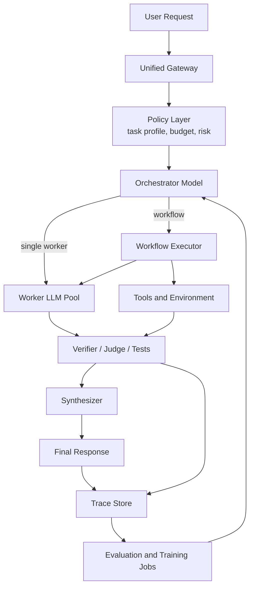

# 02. Fugu-like 系统架构蓝图

## 1. 总体架构

一个可训练的 Fugu-like 系统至少有四层：



每层职责要分开。很多团队失败是因为把 orchestrator、执行器、日志、评测和模型调用混在一个 agent prompt 里，最后既不可训练，也不可调试。

## 2. 控制面对象

### 2.1 ModelRegistry

记录每个 worker 的能力、成本和限制。

```yaml
model_id: claude-opus-4.8
provider: anthropic
capabilities:
  - coding
  - debugging
  - cybersecurity
context_window: 200000
supports_tools: true
supports_json_schema: false
price_input_per_mtok: 15.0
price_output_per_mtok: 75.0
latency_p50_ms: 3200
latency_p95_ms: 11000
data_policy:
  training_opt_out: true
  allowed_regions: ["us", "jp"]
status: active
```

没有 ModelRegistry，orchestrator 不可能学到真实约束；它只会学 benchmark 能力，而不会学生产系统里的成本、延迟和合规。

### 2.2 TaskProfile

每个请求进入模型前先打标签。

```yaml
task_id: req_2026_06_30_001
task_type: code_debugging
risk_level: medium
latency_budget_ms: 30000
cost_budget_usd: 0.50
citation_required: false
tool_required: true
privacy_level: normal
quality_floor: strong_direct_equivalent
```

TaskProfile 可以先由规则产生，后续再训练 classifier。

### 2.3 Strategy

统一入口不应该只有一种执行方式。

```yaml
strategies:
  cheap_direct:
    description: "便宜模型直接回答"
  strong_direct:
    description: "强模型直接回答"
  cheap_then_verify:
    description: "便宜模型先答，失败后升级"
  selection_head:
    description: "Fugu-like 单 worker 选择"
  workflow_orchestrator:
    description: "Fugu-Ultra/Conductor-like 多步 workflow"
  fusion_panel:
    description: "多模型并行候选 + judge 合成"
```

### 2.4 Trace

Trace 是训练 Fugu-like 系统的燃料。

```json
{
  "request_id": "req_001",
  "input_hash": "sha256:...",
  "task_profile": {"task_type": "code_debugging", "risk_level": "medium"},
  "strategy": "workflow_orchestrator",
  "orchestrator_output": {
    "workflow": [
      {"step": 1, "worker": "model_a", "subtask": "inspect failing test", "access": []},
      {"step": 2, "worker": "model_b", "subtask": "propose fix", "access": [1]}
    ]
  },
  "worker_calls": [
    {"worker": "model_a", "cost": 0.08, "latency_ms": 4200, "status": "ok"},
    {"worker": "model_b", "cost": 0.11, "latency_ms": 6100, "status": "ok"}
  ],
  "verifier": {"tests_passed": true, "rubric_score": 0.84},
  "final_reward": 1.0,
  "failure_labels": []
}
```

如果不保存 trace，你就只能做 prompt 调参，不能训练 orchestrator。

## 3. 执行面：Workflow Executor

Conductor/Fugu Ultra 的 workflow 不能直接信任，必须经过执行器。

执行器职责：

1. 解析 orchestrator 输出。
2. 验证 schema。
3. 检查 worker id 是否允许。
4. 检查 step 数、预算、工具权限。
5. 根据 access list 构造每个 worker 的上下文。
6. 隔离当前 workflow 内的 agent 私有 transcript。
7. 路由工具调用结果给正确 agent。
8. 收集输出并交给 verifier/synthesizer。

推荐 schema：

```json
{
  "workflow_id": "wf_001",
  "steps": [
    {
      "id": 1,
      "worker": "gpt-5.5",
      "role": "planner",
      "subtask": "Identify the likely root cause from the failure log.",
      "access": [],
      "tool_policy": ["read_files", "run_tests"],
      "max_tokens": 2000
    },
    {
      "id": 2,
      "worker": "claude-opus-4.8",
      "role": "debugger",
      "subtask": "Use step 1 and propose the smallest code change.",
      "access": [1],
      "tool_policy": ["read_files"],
      "max_tokens": 2000
    }
  ],
  "final": {
    "worker": "gpt-5.5",
    "subtask": "Synthesize a final patch plan from previous steps.",
    "access": [1, 2]
  }
}
```

## 4. 训练面：三种模型

### 4.1 Router Classifier

最简单，输入请求，输出策略或 worker。

```text
input -> task_type / easy_or_hard / cheap_ok / strong_needed
```

训练数据来自历史请求和多模型 replay。

### 4.2 Selection-head Orchestrator

对应 Fugu/TRINITY 低延迟路线。

```text
input/transcript -> hidden state -> logits over workers
```

适合：

- 单步或每 turn 选择一个 worker。
- 需要低延迟。
- worker pool 固定或变化不频繁。

### 4.3 Workflow Generator

对应 Conductor/Fugu Ultra 路线。

```text
input + worker descriptions + constraints -> JSON workflow
```

适合：

- 深度研究。
- 复杂代码任务。
- 多工具、多步骤、可验证任务。

## 5. 评测面

Fugu-like 系统不能只看“答案好不好看”。至少要有四类评测：

| 评测 | 目的 |
|---|---|
| RouterBench-like | 证明成本-质量曲线更优 |
| DRACO-like | 证明深度研究事实、引用、完整性提升 |
| Agentic coding tests | 证明工具长链任务成功率提升 |
| Safety/compliance audit | 证明不会越权调用模型或泄漏数据 |

## 6. 最小可用架构

如果你从零开始，不要一上来训练 7B Conductor。最小版本：

```text
Week 1:
  LiteLLM/OpenAI-compatible gateway
  ModelRegistry
  TraceStore
  fixed strategies: cheap_direct, strong_direct, fusion_panel

Week 2:
  replay 200-500 tasks across 3-5 workers
  compute reward/cost/latency
  train first router classifier

Week 3-6:
  add workflow schema
  use strong model to generate workflow
  validate and execute workflow
  collect traces

Month 2-3:
  train selection head or small workflow model
  optimize on end-to-end rewards
```

## 7. 最重要的工程原则

1. **先有日志，再谈训练。**
2. **先有可验证任务，再谈 reward。**
3. **先固定 workflow schema，再让模型自由生成。**
4. **先 offline replay，再 online learning。**
5. **所有模型调用都要带成本、延迟和权限标签。**
6. **Orchestrator 的输出必须可审计、可回放、可拒绝执行。**

