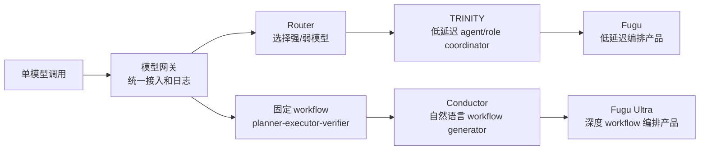

# 从 Conductor、TRINITY 到 Sakana Fugu：学习型多模型编排的领导汇报讲稿

报告日期：2026-06-30  
适用场景：给业务/技术领导解释“为什么多模型编排正在成为新的 AI 能力层，以及 Fugu 到底代表什么”  
核心论文：

1. **Learning to Orchestrate Agents in Natural Language with the Conductor**
2. **TRINITY: An Evolved LLM Coordinator**
3. **Sakana Fugu Technical Report**

---

## 0. 会议开场：先给领导一个总判断

可以这样开场：

> 今天这三篇论文讲的不是“又出了一个更大的模型”，而是一个新的方向：把多个强模型组织起来，让一个训练过的 orchestrator 决定谁来做、怎么分工、谁验证、怎么合成。  
> Conductor 证明复杂 workflow 可以由模型学习生成；TRINITY 证明低延迟的模型/角色选择也可以训练出来；Fugu 则把这两条路线产品化成一个“像单模型一样调用、内部是多模型团队”的系统。

一句话版本：

> 大模型下一阶段的竞争，不只是单体模型谁更强，而是谁能把模型、工具、任务、评测和成本组织成更可靠的执行系统。

### 0.1 一页版高管摘要

如果领导只给 3 分钟，讲这四句话：

1. **行业变化**
   - Frontier model 正在专长分化：有的擅长代码，有的擅长数学科学，有的擅长长上下文和工具调用。
   - 因此“单一最强模型”不再是所有任务的成本/质量最优解。

2. **技术变化**
   - Conductor、TRINITY、Fugu 这三篇论文共同说明：模型之间的组织方式本身可以被训练。
   - 这不是简单 prompt，也不是普通网关，而是把“谁来做、怎么做、谁验证、如何合成”变成可学习策略。

3. **产品变化**
   - Fugu 把多模型编排包装成一个单模型接口。用户看到一个模型，内部是一个训练过的 model/team orchestrator。
   - 低延迟版解决“快速选谁”，Ultra 版解决“复杂任务怎么拆、怎么协作”。

4. **我们的策略**
   - 不建议一开始自研 Fugu。
   - 先建设统一入口、日志、评测、router/cascade；对高价值任务做 workflow/fusion；等有足够 trace 和 reward 后再训练内部 coordinator。

### 0.2 本次汇报要争取的领导共识

这份汇报最好不要只停留在“论文很有意思”。会议结束时应该形成三个共识：

| 需要达成的共识 | 领导需要理解的点 |
|---|---|
| 方向共识 | 多模型编排是新的 AI 能力层，不是普通 API 聚合 |
| 投入共识 | 短期投入重点应是日志、评测和统一入口，不是直接训练 Fugu |
| 试点共识 | 选择 2-3 类高价值任务做 replay 和 workflow PoC，用公司自己的任务验证 ROI |

可以明确向领导要的决策：

```text
1. 是否允许我们建设统一 AI 模型入口和调用日志？
2. 是否允许选择 200-500 个真实任务做多模型 replay？
3. 是否批准对 Fugu/Fugu Ultra/Fusion 做同一任务集的外部 baseline 评测？
4. 是否设立一个 4-6 周 PoC，用数据判断是否进入下一阶段？
```

---

## 1. 为什么这件事值得领导关注

### 1.1 以前的问题：我们把“模型能力”理解得太单一

过去我们经常用一个问题做模型选型：

```text
哪个模型最强？
```

但企业真实任务不是这样。真实任务里至少有五个维度：

| 维度 | 例子 |
|---|---|
| 质量 | 答案是否正确、完整、可执行 |
| 成本 | 每次调用花多少钱 |
| 延迟 | 用户能不能等 |
| 风险 | 错误会不会造成严重后果 |
| 合规 | 数据能不能发给某个 provider |

单一最强模型不可能在所有任务上都是最优：

- 简单任务用最强模型太贵。
- 长任务里单模型容易卡在自己的错误路径里。
- 不同模型有不同专长：代码、数学、科学、长上下文、工具调用、事实检索、审查能力都可能不同。
- 企业还需要日志、回放、评测、成本归因和合规策略。

所以新问题应该是：

```text
这个任务应该由哪个模型、哪个角色、哪种流程来完成？
```

这就是三篇论文共同研究的事情：**学习型编排**。

### 1.2 什么叫“编排”

编排不是简单转发 API，也不是把多个模型并行回答后做投票。

编排包括：

```text
任务识别
  -> 选择模型
  -> 分配角色
  -> 拆成子任务
  -> 设计通信拓扑
  -> 控制工具调用
  -> 验证中间结果
  -> 合成最终答案
  -> 用结果继续训练策略
```

领导可以把它理解成：

> 不是雇一个万能专家，而是训练一个项目经理，让他知道什么时候找算法专家、什么时候找代码专家、什么时候找审稿人，以及怎么让他们协作。

---

## 2. 三篇论文的递进关系

这三篇不是孤立论文，而是一条非常清晰的技术路线。

| 论文 | 它回答的问题 | 关键词 | 对 Fugu 的关系 |
|---|---|---|---|
| Conductor | 能不能训练模型直接写多 agent workflow？ | 自然语言 workflow、GRPO、subtask、access list | Fugu Ultra 的深度编排基础 |
| TRINITY | 能不能用小 coordinator 低延迟地选 agent/role？ | hidden-state head、Thinker/Worker/Verifier、sep-CMA-ES | Fugu 低延迟版的研究原型 |
| Fugu Technical Report | 能不能把这些研究产品化成单模型接口？ | single model API、agent pool、selection head、workflow state | 产品化整合 |

递进逻辑：

```text
Conductor：先证明“复杂协作流程可以被模型学会生成”
TRINITY：再证明“低延迟、有限动作的协调器也可以训练出来”
Fugu：最后把两条路线合并，做成用户像调用一个模型一样使用的产品
```

### 2.1 为什么我建议按这个顺序讲

虽然 TRINITY 和 Conductor 都是 Sakana 系列相关研究，但对领导汇报时不建议按论文发表顺序或技术细节顺序讲，而建议按“问题递进”讲：

1. **先讲 Conductor**
   - 让领导先理解最高阶目标：AI 不只是回答问题，也可以设计协作流程。
   - 这能建立“orchestrator 是项目经理”的直觉。

2. **再讲 TRINITY**
   - 解释为什么不是所有请求都应该走复杂 workflow。
   - 引出低延迟、高频路径：小 coordinator 快速选择 agent/role。

3. **最后讲 Fugu**
   - Fugu 就变得容易理解：它不是凭空冒出来的产品，而是把 Conductor 的深度编排和 TRINITY 的低延迟选择合并成产品形态。

### 2.2 三篇论文分别应该让领导记住什么

| 论文 | 领导只需记住的一句话 | 不要让领导误解成 |
|---|---|---|
| Conductor | 复杂多模型 workflow 可以通过 RL 学出来 | 所有请求都要走多 agent |
| TRINITY | 小 coordinator 可以低延迟地学习选择 agent 和 role | 只靠手写规则或 prompt 就够 |
| Fugu | 多模型编排可以产品化成单模型接口 | Fugu 就是一个普通大模型 |

### 2.3 这三篇论文共同补齐了一个系统闭环

```text
Conductor 解决表达力：怎么描述复杂协作？
TRINITY 解决效率：怎么在低延迟下做可训练选择？
Fugu 解决产品化：怎么把这套东西封装成用户可调用的模型？
```

---

## 3. 第一篇：Conductor 讲的是“让模型学会写协作方案”

论文：**Learning to Orchestrate Agents in Natural Language with the Conductor**

### 3.1 这篇论文解决什么问题

传统多 agent 系统很多是手写流程，例如：

```text
planner -> executor -> verifier
```

或者：

```text
model A, B, C 并行回答 -> aggregator 汇总
```

这种流程简单，但有明显缺陷：

- 所有任务都被迫套同一种模板。
- 子任务提示词是固定的，不能精细适配任务。
- agent 之间谁能看到谁的输出是固定的。
- 复杂任务和简单任务消耗的 compute 没有差异。

Conductor 提出的问题是：

> 能不能训练一个模型，让它不是直接回答问题，而是输出一个多 agent 协作方案？

### 3.2 Conductor 输出的不是答案，而是 workflow

Conductor 的输出可以理解为一个自然语言版的执行计划：

```text
step 1: 让 worker 2 设计算法，不能看到其他输出
step 2: 让 worker 0 根据 step 1 写代码
step 3: 让 worker 1 检查边界条件，只能看到 step 1 和 step 2
```

论文里的 workflow step 主要包含三件事：

| 字段 | 含义 |
|---|---|
| assigned worker agent | 这一轮交给哪个模型 |
| subtask instruction | 给这个模型的子任务提示 |
| access / visibility | 这个模型能看到哪些前序结果 |

这一步非常重要。它把 LLM 从“答题者”升级成“组织者”：

- 答题者：直接回答。
- 组织者：决定谁来做、按什么顺序做、看哪些上下文、如何收敛。

### 3.3 Conductor 怎么训练

Conductor 用强化学习训练。流程可以这样解释给领导：

```text
输入一个可验证问题
  -> Conductor 生成 workflow
  -> 系统解析 workflow
  -> 按 workflow 调用多个 worker LLM
  -> 得到最终答案
  -> 根据答案是否正确给 reward
  -> 更新 Conductor
```

reward 至少有两层：

1. **格式 reward**
   - workflow 是否能被解析。
   - worker list、subtask list、access list 是否合法。

2. **正确性 reward**
   - 执行 workflow 后，最终答案是否正确。

这告诉我们一个落地原则：

> 训练编排模型不能只奖励“答案看起来好”，还要奖励“计划可执行、权限合法、预算合规、结果可验证”。

### 3.4 Conductor 的价值

Conductor 的关键贡献不是“用了多个模型”，而是把以下东西变成可学习对象：

- 任务怎么拆。
- 每一步给哪个模型。
- 给模型写什么子 prompt。
- 哪些模型独立工作。
- 哪些模型看前序结果。
- 哪些模型负责验证或合成。

论文观察到一些自然涌现的策略：

- 先规划，再执行。
- 多个模型并行探索，再聚合。
- 让一个模型验证另一个模型。
- 对难题调用更多 agent，对简单题少调用。
- 允许 Conductor 递归调用自己，做进一步修正。

对领导要强调：

> Conductor 不是在教模型答题，而是在教模型组织模型团队。

### 3.5 Conductor 的局限

这篇论文也有边界：

- 需要可验证 reward，代码、数学、选择题更适合。
- 自然语言 workflow 可能格式错误，生产中必须有 schema、parser、validator。
- 多 agent workflow 成本和延迟高，不适合所有请求。
- 工具调用和状态管理会复杂，尤其是多个 agent 同时操作环境时。

会议讲法：

> Conductor 证明了上限：复杂流程可以学出来。但它不是低成本默认路径，更像高价值复杂任务的深度编排器。

### 3.6 带领导读 Conductor：建议重点看什么

不建议在会上逐页读 39 页论文。建议带读 5 个点：

| 论文位置 | 给领导看的内容 | 你要解释的业务含义 |
|---|---|---|
| Abstract | 训练 Conductor 自动发现 coordination strategies | 这是“训练组织能力”，不是手写流程 |
| Figure 2 | Conductor 输出 worker id、subtasks、access list | workflow 是可执行结构，不是泛泛计划 |
| Section 3.1 | workflow step 的定义 | 子任务、模型分配、可见性是编排核心 |
| Section 3.1 reward | format condition + correctness condition | 生产 reward 也要同时管格式、质量、预算、权限 |
| Section 3.2 | randomized agent pools 和 recursive topologies | 未来可适配不同模型池，也可做 test-time scaling |

### 3.7 Conductor 可以怎么类比给非技术领导

可以用项目管理类比：

```text
普通 LLM：一个专家自己做完任务。
固定多 agent：固定流程，比如“先规划、再执行、再审核”。
Conductor：训练一个项目经理，根据任务临时决定找谁、怎么分工、谁看谁的结果。
```

这个类比有助于领导理解为什么 Conductor 的输出不是答案，而是工作流。

### 3.8 Conductor 对企业落地的直接启示

1. **先定义 workflow schema**
   - 不要一开始让模型自由发挥。
   - 至少要定义 step、worker、subtask、access、budget、tool policy。

2. **先做可验证任务**
   - 代码测试、数学、结构化抽取、引用验证更适合早期训练。
   - 战略分析、法律意见、业务判断可以晚一点做，因为 reward 更难。

3. **先用强模型/人工生成 teacher workflows**
   - 初期不需要训练 Conductor。
   - 可以先让强模型生成 workflow，再用 validator 执行和打分。

4. **不要把多 agent 当默认路径**
   - Conductor 是高价值复杂任务路径。
   - 简单任务应该走 direct/router/cascade。

---

## 4. 第二篇：TRINITY 讲的是“把编排压缩成低延迟选择”

论文：**TRINITY: An Evolved LLM Coordinator**

### 4.1 为什么还需要 TRINITY

如果 Conductor 很强，为什么还要看 TRINITY？

因为 Conductor 的表达力强，但成本和延迟也高。生产系统里大量请求不需要完整 workflow，只需要快速判断：

```text
这个任务交给哪个模型？
这一轮让它规划、执行，还是验证？
```

TRINITY 就是更克制、更工程化的路线。

### 4.2 TRINITY 的核心设计

TRINITY 用一个小型 coordinator 模型，加一个轻量 head，在每一轮做两个选择：

```text
action = 选择哪个 agent + 选择哪个 role
```

role 有三类：

| 角色 | 作用 | 企业类比 |
|---|---|---|
| Thinker | 规划、拆解、提出思路 | 方案设计者 |
| Worker | 执行推理、写代码、计算 | 执行专家 |
| Verifier | 检查、纠错、发现遗漏 | 审稿人/质检 |

这说明一个关键点：

> 多模型系统不是简单“选哪个模型”，而是“让哪个模型在当前阶段扮演什么职责”。

一个模型写代码强，不代表它验证代码也强。另一个模型可能生成一般，但特别会审查边界条件。TRINITY 把这种差异显式建模。

### 4.3 为什么它不是普通 prompt router

很多团队会想：

```text
让一个强模型先看任务，然后问它该选哪个模型，不就行了吗？
```

TRINITY 的实验说明这不够。论文里 prompted LLM as coordinator 明显弱于训练过的 TRINITY。

原因很现实：

- 强模型并不天然知道每个 worker 在我们任务分布里的真实表现。
- 它也不知道每个 worker 在 planner、executor、verifier 角色上的差异。
- 这些知识必须从任务结果、失败样本和 reward 中学习。

所以：

> Prompt-only 调度是启发式；训练过的 coordinator 才是可积累的系统能力。

### 4.4 TRINITY 怎么训练

TRINITY 用的是 sep-CMA-ES，一种黑盒演化优化方法。

领导不需要记算法细节，只需要理解为什么用它：

| 训练难点 | 含义 |
|---|---|
| worker 是黑盒 API | 不能对 Claude/GPT/Gemini 反向传播 |
| reward 稀疏 | 最后答对/答错，中间谁贡献多少不清楚 |
| 调用昂贵 | 每评估一次 coordinator，都要真实调用多个模型 |
| 参数很少 | 轻量 head 参数少，适合黑盒优化 |

TRINITY 的训练不是让 worker 变强，而是让 coordinator 学会：

- 当前 transcript 表示什么任务状态。
- 该找哪个 agent。
- 该让它做 Thinker、Worker 还是 Verifier。
- 什么时候停止。

### 4.5 TRINITY 的价值

对我们最重要的是三点：

1. **小模型可以组织大模型**
   - coordinator 不需要自己会所有任务。
   - 它只需要学会“谁擅长什么，什么时候调用谁”。

2. **低延迟路径可行**
   - 不必每次都生成完整 workflow。
   - 可以在高频请求上快速选模型。

3. **编排策略能通过结果训练**
   - 不只是手写规则。
   - 也不只是 prompt 强模型临时判断。

### 4.6 TRINITY 的局限

TRINITY 的 action space 是有限的：

```text
agent selection + role selection
```

它不能像 Conductor 那样自由写子任务、设计 access list、构造任意通信拓扑。

所以会议上可以这样总结：

> TRINITY 证明了低延迟、可控、有限动作的 coordinator 可以训练；Conductor 证明了高表达力、自然语言 workflow 的 coordinator 可以训练。二者不是互斥，而是两条产品路线。

### 4.7 带领导读 TRINITY：建议重点看什么

| 论文位置 | 给领导看的内容 | 你要解释的业务含义 |
|---|---|---|
| Abstract | 0.6B coordinator + 轻量 head + 少量可学习参数 | 不需要大模型自己做所有事，小模型也能做调度 |
| Figure 1 | Thinker / Worker / Verifier 多轮例子 | 同一个模型团队里要有分工，不只是投票 |
| Section 2 | state、action、trajectory、terminal reward | 编排训练目标是最终任务成功，不是中间步骤好看 |
| Section 3.1 | hidden state + lightweight head | 低延迟路线依赖内部表征，不靠完整文本生成 |
| sep-CMA-ES 部分 | 黑盒优化原因 | worker 是 API 时，不能用常规反向传播解决一切 |
| Ablation | 去掉 agent/role/训练算法会下降 | 价值来自组织决策，而不是某个单点 trick |

### 4.8 TRINITY 对我们做网关/路由的启发

很多企业第一版会写这种规则：

```text
代码任务 -> Claude
数学任务 -> GPT
长文任务 -> Gemini
```

TRINITY 暗示这还不够。更好的模型画像应包含：

| 维度 | 示例 |
|---|---|
| 任务类型能力 | coding、math、science、long context |
| 协作角色能力 | planner、executor、verifier、summarizer |
| 工具场景能力 | edit repo、run tests、web research、SQL |
| 交互阶段能力 | 初始规划、失败恢复、最终合成 |
| 成本/延迟特征 | cheap、fast、expensive、slow but reliable |

这意味着我们的日志不能只记“用了哪个模型”，还要记：

- 它在什么角色下被调用。
- 调用前上下文是什么。
- 结果是否被后续 verifier 接受。
- 如果失败，是执行错、计划错还是验证错。

### 4.9 TRINITY 的产品意义

TRINITY 提供的是高频路径思路：

```text
用户请求进来
  -> 小 coordinator 快速读上下文
  -> 选择 worker/role
  -> worker 生成
  -> 必要时 verifier 检查
```

它不一定每次都省钱，但它提供了两种商业价值：

1. **降低平均成本**
   - 不让所有请求都走最贵模型。
   - 简单或特定任务可以路由到合适 worker。

2. **降低组织延迟**
   - 不用每次让强模型先生成一段调度理由。
   - 轻量 head 可以更快给出 action。

---

## 5. 第三篇：Fugu 讲的是“把两条研究线产品化”

论文：**Sakana Fugu Technical Report**

### 5.1 Fugu 要解决的问题

Fugu Technical Report 的核心问题是：

> 既然不同 frontier model 有不同专长，能不能训练一个 orchestrator，把它们像一个模型一样提供给用户？

用户侧看到：

```text
调用一个 model name
```

系统内部可能发生：

```text
任务识别
  -> worker 选择
  -> 多 agent workflow
  -> 工具调用
  -> 验证
  -> 合成答案
```

这就是 Fugu 的定位：

```text
single model API 外壳 + multi-agent orchestration 内核
```

### 5.2 Fugu 有两个版本，对应前两篇论文

| Fugu 版本 | 对应研究路线 | 目标 | 适合场景 |
|---|---|---|---|
| Fugu | TRINITY-like | 低延迟、日常任务、快速选择 worker | 交互式 coding、普通问答、常规推理 |
| Fugu Ultra | Conductor-like | 高质量、多步骤、深度 workflow | 复杂代码、科研、终端任务、深度分析 |

这点非常适合给领导讲：

> Fugu 不是一个单点技术，而是把“低延迟选择”和“高质量编排”做成两个产品档位。

### 5.3 Fugu 低延迟版怎么做

Fugu 低延迟版接近 TRINITY，但做了生产简化：

- 使用 orchestrator backbone 的 hidden state。
- 用 lightweight selection head 输出 worker logits。
- 只选择 worker，不再分配 Thinker/Worker/Verifier 角色。
- 不等 orchestrator 生成长文本，而是快速把任务交给 worker。

为什么不保留 TRINITY 的三角色？

因为生产系统里，高频请求更看重：

- 低延迟。
- 简单可控。
- 选择动作空间小。
- 易优化和回放。

这给我们的启发是：

> 研究结构最强，不等于产品结构最合适。高频路径要克制。

### 5.4 Fugu 低延迟版如何训练

Fugu 报告公开的训练思路大致是：

1. **单步任务 SFT**
   - 对每个任务，让 worker pool 里的多个模型都作答。
   - 根据 ground truth 或 verifier 得到每个 worker 的 reward。
   - 把 reward 转成 soft target distribution。
   - 训练 selection head 预测哪个 worker 更适合。

2. **端到端任务上的演化优化**
   - 单步任务不够，还要看真实多轮 agent 使用。
   - 例如代码助手环境：读仓库、改文件、跑测试、处理反馈。
   - 用 sep-CMA-ES 等黑盒优化，直接优化最终任务是否完成。

领导版解释：

> 第一阶段学“哪个模型在什么题上表现好”，第二阶段学“在真实工具链和多轮交互里，哪个模型在什么阶段更可靠”。

### 5.5 Fugu Ultra 怎么做

Fugu Ultra 继承 Conductor 思路：

- 生成多步骤 workflow。
- 每一步指定 worker、subtask、access/visibility。
- 用 GRPO 类强化学习训练 workflow 生成。
- 支持 function calling、多 agent 工具交互、workflow state。
- 引入 agent isolation 和 shared memory，避免多 agent 互相污染。

这里有一个很关键的生产问题：**状态管理**。

多 agent 工具调用不是简单聊天。如果 agent A 读了文件、agent B 跑了测试、agent C 写了补丁，系统必须知道：

- 谁发起了哪个工具调用。
- 工具结果应该回到哪个 agent。
- 哪些 agent 能看到这些结果。
- 哪些上下文应该隔离，哪些应该共享。

Fugu Technical Report 里强调：

- workflow state
- intra-workflow agent isolation
- persistent shared memory
- 防止 orchestration collapse

这说明：

> Fugu Ultra 的难点不只是模型训练，还包括多 agent 执行环境的工程治理。

### 5.6 Fugu 的实验结果应该怎么读

Fugu 报告展示了在 SWE-Bench Pro、Terminal Bench、LiveCodeBench、GPQA-Diamond、Humanity's Last Exam、CharXiv 等任务上的强表现。

我们给领导汇报时不要只报分数，而要讲分数背后的机制：

1. **Terminal/Coding 任务**
   - Fugu 能在不同 worker 之间切换。
   - 一个模型可能擅长构建，另一个模型擅长 debug。

2. **GPQA/科学推理**
   - Fugu 会倾向调用科学/数学能力更强的 worker。

3. **多学科任务**
   - Fugu Ultra 会更均衡地使用多个 agent。

核心解释：

```text
收益来自识别不同模型的专长，并在正确任务阶段调用它们。
```

而不是：

```text
多叫几个模型一定更好。
```

### 5.7 Fugu 的风险

Fugu 很有方向性，但不能无脑采用。

| 风险 | 解释 |
|---|---|
| 黑盒性 | 用户不一定知道内部选了哪些 worker |
| 供应商依赖 | 底层 worker pool 依赖多个 frontier model |
| 成本和延迟 | Ultra 路线一定比 direct call 更重 |
| 评测外推 | 论文 benchmark 不等于我们的业务任务 |
| 合规治理 | 不同 provider 的数据策略不同 |
| 失败归因 | 错在路由、worker、工具、workflow 还是合成，需要日志 |

会议讲法：

> Fugu 是一个非常值得关注的目标形态，但企业不能只看公开分数。真正决策要用自己的任务、自己的成本、自己的合规要求复验。

### 5.8 带领导读 Fugu Technical Report：建议重点看什么

| 论文位置 | 给领导看的内容 | 你要解释的业务含义 |
|---|---|---|
| Abstract | Fugu 是 trained orchestrator models | 这是产品化编排层，不是普通模型排行榜 |
| Introduction | 不同 frontier LLM 专长分化 | 为什么“一个模型打天下”越来越不经济 |
| Section 3.1 | Fugu 低延迟 selection head | 高频路径要快，不能每次都深度协作 |
| Section 3.1.2 | soft target distribution SFT | 训练时要比较多个 worker 在同一任务上的表现 |
| Section 3.1.3 | end-to-end tasks + evolutionary strategies | 真正生产效果要看工具链和多轮轨迹 |
| Section 3.2 | Fugu Ultra / Conductor workflow | 高价值任务需要深度组织 |
| Section 3.2.2 | function calling workflow state 和 isolation | 多 agent 落地难点在状态和权限管理 |
| Section 4.2 | domain adaptivity | 好的 orchestrator 应该按领域改变 worker 分布 |

### 5.9 Fugu 里最值得我们学的不是分数，而是产品分层

Fugu 的关键产品判断是“双轨制”：

```text
Fugu：日常任务，低延迟，快速选择 worker。
Fugu Ultra：困难任务，高质量，多步骤 workflow。
```

这对我们的启示很直接：

- 如果做用户实时交互，不要默认上复杂多 agent。
- 如果做深度研究/代码修复/安全分析，可以允许更高成本和延迟。
- 所有请求都走一个策略，会同时伤害成本和体验。

### 5.10 Fugu 对组织能力的要求

如果我们将来要自建 Fugu-like，不只是模型团队要做，还需要平台能力：

| 能力 | 为什么必须有 |
|---|---|
| 统一模型入口 | 否则无法替换 worker，也无法统计成本 |
| TraceStore | 没有轨迹就没有训练数据 |
| ModelRegistry | 需要知道每个模型能力、价格、限制 |
| Evaluation Harness | 必须能回放任务、比较策略 |
| Workflow Executor | 模型输出的 workflow 需要被安全执行 |
| Tool Sandbox | 多 agent 工具调用必须受控 |
| Reward System | 没有 reward 就没有学习闭环 |
| Rollback / Fallback | 编排失败时要能降级到 direct strong model |

### 5.11 Fugu 的采购/试用判断方式

如果领导问“那我们要不要直接买 Fugu”，可以这样回答：

> 可以试，但要按 baseline 评测，不要按宣传分数采购。

建议评测矩阵：

| 策略 | 用途 |
|---|---|
| strong_direct | 最强单模型基线 |
| cheap_direct | 成本下限 |
| router/cascade | 自建降本基线 |
| Fusion/panel | 可解释多模型评议基线 |
| Fugu | 低延迟外部 orchestrator |
| Fugu Ultra | 高质量外部 orchestrator |

评测必须记录：

- 质量得分。
- 成本。
- 延迟。
- 失败率。
- 引用/事实错误。
- 人工返工时间。
- 合规风险。

---

## 6. 把三篇论文串起来：这到底是一个什么事情

### 6.1 技术路线图



### 6.2 三篇论文共同证明的事情

1. **模型能力正在专长分化**
   - 不同模型在代码、数学、科学、长上下文、工具调用上有差异。

2. **组织方式本身可以带来能力增益**
   - 不改变 worker 权重，只改变谁来做、怎么做，也能提升结果。

3. **编排策略可以被训练**
   - Conductor 用 RL 学 workflow。
   - TRINITY 用演化策略学 agent/role selection。
   - Fugu 把这些能力做成产品。

4. **生产化需要双路线**
   - 高频任务：低延迟选择。
   - 高价值任务：深度 workflow。

5. **评测和日志是核心资产**
   - 没有任务轨迹和 reward，就无法训练自己的 orchestrator。

### 6.3 这不是简单多模型 API 聚合

普通多模型聚合：

```text
把请求发给多个模型 -> 汇总答案
```

学习型编排：

```text
理解任务状态 -> 选择模型/角色/流程 -> 控制上下文和工具 -> 验证结果 -> 用任务结果继续训练
```

差异在于：

| 维度 | 普通聚合 | 学习型编排 |
|---|---|---|
| 策略 | 手写或固定 | 从任务结果中学习 |
| 结构 | 通常固定 | 可按任务变化 |
| 目标 | 多视角 | 任务完成、成本、延迟、合规 |
| 数据资产 | 输出日志 | 可训练 trace/reward |
| 产品形态 | 工具/网关 | 类模型能力层 |

### 6.4 三篇论文的深度对照矩阵

| 维度 | Conductor | TRINITY | Fugu |
|---|---|---|---|
| 核心问题 | 如何生成复杂 workflow | 如何低延迟选择 agent/role | 如何产品化 learned orchestration |
| Orchestrator 输出 | 自然语言 workflow | 有限 action logits | worker selection 或 workflow |
| 运行时形态 | 多 agent、多 step | 多轮有限动作协调 | 单模型 API 外观 |
| 训练信号 | format + correctness reward | terminal reward | SFT + evolutionary + RL |
| 优点 | 表达力强 | 低延迟、可控 | 产品封装完整 |
| 缺点 | 成本/延迟/解析复杂 | action space 有限 | 黑盒、供应商依赖 |
| 适合场景 | 高价值复杂任务 | 高频交互和阶段性调度 | 对外统一能力入口 |
| 我们该学什么 | workflow schema 和 reward | 轻量 coordinator 和角色分工 | 双轨产品化和执行状态管理 |

### 6.5 这条路线的本质变化

以前的 AI 产品能力主要来自：

```text
模型参数规模 + prompt 工程
```

这三篇论文指向的新能力来自：

```text
模型池 + 编排策略 + 执行环境 + reward 数据 + 持续评测
```

这意味着未来竞争点会变化：

| 过去 | 未来 |
|---|---|
| 谁接入了最强模型 | 谁知道什么任务该用什么模型 |
| 谁 prompt 写得好 | 谁有可训练的 workflow traces |
| 谁单次回答漂亮 | 谁端到端任务完成率高 |
| 谁模型调用量大 | 谁成本-质量曲线更优 |
| 谁能快速接 API | 谁能治理多 provider、工具和数据合规 |

---

## 7. 对我们公司的判断

### 7.1 不建议一上来“自研 Fugu”

原因：

- 需要大量真实任务轨迹。
- 需要可靠 reward。
- 需要多 worker replay。
- 需要执行器、工具隔离、日志回放。
- 训练和评测成本高。

更现实的路线：

```text
统一入口
  -> 任务日志
  -> 成本/延迟/质量评测
  -> 规则 router
  -> 训练 router
  -> 固定 workflow
  -> 学习型 coordinator
```

### 7.2 我们应该先建设什么

第一阶段不是训练模型，而是建设数据闭环：

| 模块 | 为什么重要 |
|---|---|
| ModelRegistry | 知道每个模型成本、能力、限制 |
| TraceStore | 记录每次请求选了谁、结果如何 |
| Evaluation Harness | 能复验不同策略 |
| Router/Cascade | 先拿降本收益 |
| Workflow Schema | 为未来 Conductor-like 训练铺路 |
| Internal Benchmark | 用我们自己的任务判断效果 |

### 7.3 什么时候使用外部 Fugu

可以把 Fugu/Fugu Ultra 当作外部 baseline 或高难任务供应商：

- 长任务。
- 复杂代码调试。
- 深度研究。
- 多步骤工具任务。
- 需要强 agentic workflow 的任务。

但不应把核心判断完全交给外部黑盒。我们仍应保留：

- 自己的统一入口。
- 自己的日志。
- 自己的评测集。
- 自己的策略回放。

### 7.4 什么时候考虑自建 Fugu-like

满足这些条件再考虑：

- 已有 2k-10k 真实任务 trace。
- 能评估 cheap/strong/多个 worker 在同一任务上的表现。
- 至少一类高价值任务证明 workflow 比 direct call 更强。
- 有自动或人工 reward。
- 有上线后的监控和回滚能力。

### 7.5 建议的 90 天落地路线

#### 第 0-2 周：建立证据，不做大工程

目标：验证我们的任务分布是否真的有多模型编排价值。

交付：

- 200-500 个真实任务样本。
- 3-5 个候选模型 replay。
- 每个模型的质量、成本、延迟记录。
- 初版任务分类：简单、复杂、高风险、需要工具、需要引用。

判断问题：

```text
有没有足够多简单任务可以降本？
有没有某些任务明显需要特定 worker？
有没有复杂任务从多模型/workflow 中获益？
```

#### 第 3-6 周：统一入口 + Router/Cascade

目标：先拿可量化 ROI。

交付：

- 统一模型入口。
- ModelRegistry。
- TraceStore。
- cheap/strong router。
- cheap_then_verify cascade。
- 成本-质量曲线报告。

判断问题：

```text
能否在质量下降可控的前提下降低 20%-50% 平均成本？
哪些任务必须强模型直答？
哪些任务可以 cheap-first？
```

#### 第 7-10 周：Workflow PoC

目标：验证 Conductor/Fugu Ultra 路线是否适合我们的高价值任务。

交付：

- workflow schema。
- workflow executor。
- 100-300 条高质量 workflow traces。
- strong_direct vs workflow vs Fusion/Fugu 的对比。

判断问题：

```text
workflow 是否在复杂任务上真实超过 strong_direct？
提升来自事实/测试通过/完整性，还是只是答案更长？
成本和延迟是否可接受？
```

#### 第 11-13 周：训练或固化内部 coordinator

目标：从规则和外部能力，过渡到内部策略资产。

交付：

- router classifier 或 selection-head prototype。
- hard set benchmark。
- 失败标签体系。
- 灰度上线策略。
- 回滚和 fallback 机制。

判断问题：

```text
内部策略是否优于手写规则？
是否有足够数据继续训练 Fugu-like coordinator？
是否需要采购/试用外部 Fugu 作为 baseline？
```

### 7.6 会议上建议向领导要的资源

| 资源 | 为什么需要 | 最小规模 |
|---|---|---|
| 真实任务样本 | 没有任务分布就无法评估 | 200-500 条起步 |
| 模型调用预算 | 多 worker replay 需要成本 | 先控制在 PoC 预算内 |
| 业务 owner 评审 | judge 不能完全替代人工 | 每类任务抽样 20-50 条 |
| 工程时间 | 统一入口和日志是基础设施 | 1-2 名工程师 4-6 周 |
| 合规支持 | 需要定义哪些数据能发给哪些模型 | 至少明确 allowlist/denylist |

### 7.7 不做这件事的风险

如果我们完全不建设这层能力，风险不是“少一个新功能”，而是：

- 模型调用成本不可控。
- 每次换模型都靠人工经验。
- 不知道哪些任务适合便宜模型。
- 高价值任务无法系统性利用多模型互补。
- 失败案例不能沉淀成训练数据。
- 对外部 Fugu/Fusion 类产品只能被动相信厂商 benchmark。

---

## 8. 给领导的 10 分钟讲稿

### 第 1 分钟：问题背景

> 我们以前把 AI 能力理解成“找一个最强模型”。但现在不同模型出现明显专长分化，一个模型可能代码强，另一个数学强，另一个长上下文强。企业真正需要的是在每个任务上选择合适模型、合适流程、合适成本。

### 第 2-3 分钟：Conductor

> Conductor 这篇论文证明，模型不一定要直接回答问题，它可以先生成一个多 agent workflow。这个 workflow 决定每一步由哪个模型做、做什么子任务、能看哪些前序输出。然后系统执行这个 workflow，根据最终答案是否正确给 reward，用强化学习训练 Conductor。  
> 它的意义是：复杂协作流程不是只能人手写，而是可以被模型学习出来。

### 第 4-5 分钟：TRINITY

> Conductor 表达力很强，但成本和延迟高。TRINITY 走另一条路线：用一个很小的 coordinator，在每一轮只做两个选择，选哪个 agent、让它当 Thinker/Worker/Verifier。它用演化策略从最终任务结果中学习。  
> 它证明低延迟、有限动作的 coordinator 也能超过手写多 agent 和 prompt-only coordinator。

### 第 6-7 分钟：Fugu

> Fugu 把这两条路线产品化。Fugu 低延迟版更像 TRINITY，用 selection head 快速选择 worker；Fugu Ultra 更像 Conductor，生成多步骤 workflow，适合复杂任务。用户看到的是一个模型 API，内部是多模型 agent pool 和学习型编排策略。

### 第 8 分钟：为什么重要

> 这代表 AI 系统从“单模型能力竞争”进入“模型组织能力竞争”。未来的护城河不只是接入多少模型，而是谁有任务日志、reward、评测集和持续优化的 orchestrator。

### 第 9 分钟：风险

> 但不能直接把论文分数当业务结论。风险包括黑盒性、成本、延迟、供应商依赖、合规和失败归因。必须用我们的真实任务复验。

### 第 10 分钟：建议

> 我们不建议一开始自研 Fugu。建议先做统一入口、日志、评测、router/cascade 降本；再对高价值任务做 workflow/fusion；最后在数据足够后训练内部 coordinator。Fugu/Fugu Ultra 可以作为外部 baseline 和高难任务能力补充。

### 8.1 30 分钟会议版本

如果会议有 30 分钟，可以按这个节奏：

| 时间 | 内容 | 目标 |
|---:|---|---|
| 0-3 分钟 | 总判断和行业背景 | 建立“模型组织层”的概念 |
| 3-10 分钟 | Conductor | 说明复杂 workflow 可以被训练 |
| 10-16 分钟 | TRINITY | 说明低延迟 coordinator 可以训练 |
| 16-23 分钟 | Fugu | 说明研究如何产品化 |
| 23-27 分钟 | 对我们的路线 | 从论文收束到公司决策 |
| 27-30 分钟 | 资源和下一步 | 确定 PoC 范围 |

### 8.2 会议中可以使用的三张口头图

第一张图：能力从单模型变成组织层。

```text
Old: request -> strongest model -> answer
New: request -> orchestrator -> worker/team/tool/workflow -> verified answer
```

第二张图：两条产品路线。

```text
Low latency path: request -> selection head -> one worker
High quality path: request -> workflow generator -> multiple workers -> verifier/synthesizer
```

第三张图：我们的落地阶梯。

```text
logs -> replay -> router -> cascade -> workflow -> learned coordinator
```

---

## 9. 领导可能问的问题

### Q1：这和普通模型网关有什么区别？

网关只是统一调用模型。Fugu-like orchestrator 会根据任务学习选择模型、分配角色、生成 workflow、调用工具、验证和合成。网关是管道，orchestrator 是决策层。

### Q2：这是不是一定更贵？

不一定。低延迟 Fugu/TRINITY-like 路线可以通过选择合适 worker 降低不必要的强模型调用。Conductor/Fugu Ultra-like 深度 workflow 通常更贵，适合高价值任务。

### Q3：为什么不直接用最强模型？

因为最强模型对所有任务不一定成本最优，也不一定在所有细分能力上最强。复杂任务还可能需要计划、执行、验证、多视角和工具反馈。

### Q4：我们能不能自己训练一个？

可以，但不能直接跳到 Fugu。需要先积累任务 trace、多 worker replay、reward、内部 benchmark 和 workflow traces。否则训练没有监督信号。

### Q5：先买 Fugu 还是自建？

短期可以试 Fugu/Fugu Ultra 作为外部 baseline；中长期应自建统一入口和评测数据。核心资产是自己的任务分布、失败样本和 reward，不是某个外部 API。

### Q6：我们第一步应该做什么？

第一步不是训练，而是记录：

- 请求类型。
- 调了哪个模型。
- 成本和延迟。
- 用户是否接受。
- 失败原因。
- 同一任务多个模型的 replay 结果。

没有这些，就无法判断路由和编排是否真的有效。

### Q7：这和 OpenRouter Fusion、MoA 这种多模型融合有什么区别？

Fusion/MoA 更像“多个模型都回答，然后比较或合成”。Conductor/TRINITY/Fugu 更强调“先决定组织结构”：谁负责规划、谁负责执行、谁能看哪些中间结果、什么时候调用工具、什么时候验证。Fusion 是多视角合成，Fugu-like 是任务执行编排。

### Q8：如果模型越来越强，这个方向会不会没必要？

不太可能完全没必要。更强模型会提高 baseline，但企业仍需要成本控制、合规路由、工具执行、失败回放和多 provider 风险对冲。强模型也可以成为 worker pool 中的一个 agent。

### Q9：这套东西最大的技术风险是什么？

最大风险不是模型不够聪明，而是 reward 和评测不可靠。如果没有真实任务、可验证标准和失败标签，训练出来的 orchestrator 可能只是学会多调用模型、写更长答案，而不是真正提升任务成功率。

### Q10：这件事短期能产生什么业务价值？

短期最现实的价值是两类：

- 用 router/cascade 降低简单任务成本。
- 用 workflow/fusion/Fugu baseline 提升少数高价值复杂任务质量。

短期不要承诺“训练出一个 Fugu”。应该承诺“用 4-6 周验证任务分布、成本空间和复杂任务提质空间”。

### Q11：我们需要多大团队？

PoC 阶段不需要大团队。建议：

- 1 名后端/平台工程师做统一入口和日志。
- 1 名 ML/数据工程师做 replay、评测和 router。
- 1 名业务 owner 或专家抽样评审。
- 必要时 1 名安全/合规同事定义模型和数据 allowlist。

### Q12：如果领导只批准很小预算，先做什么？

只做三件事：

1. 收集 200 条真实任务。
2. 用 3 个模型 replay。
3. 做一张成本-质量曲线。

这三件事能最快判断后续值不值得投入。

---

## 10. 可以放在最后一页的结论

```text
Conductor 证明：复杂多 agent workflow 可以被模型用 RL 学出来。
TRINITY 证明：低延迟的 agent/role coordinator 可以用小模型和演化策略学出来。
Fugu 证明：这两条研究线可以产品化为一个单模型接口下的多模型编排系统。

我们的建议：
先做统一入口、日志和评测；
用 router/cascade 先拿降本；
对高价值任务做 workflow/fusion；
等 trace 和 reward 足够后，再训练内部 Fugu-like orchestrator。
```

---

## 11. 资料和本地文件

### 三篇核心论文

- Conductor: `papers/pdfs/conductor_natural_language_orchestration_2512.04388.pdf`
- TRINITY: `papers/pdfs/trinity_evolved_llm_coordinator_2512.04695.pdf`
- Fugu Technical Report: `papers/pdfs/fugu_technical_report_2606.21228.pdf`

### 本仓库已有深度解析

- `papers/analyses/03_conductor_natural_language_orchestration.md`
- `papers/analyses/02_trinity_evolved_llm_coordinator.md`
- `papers/analyses/01_fugu_technical_report.md`

### 训练路线参考

- `fugu_like_training_guide/`

### 公开链接

- Conductor: https://arxiv.org/abs/2512.04388
- TRINITY: https://arxiv.org/abs/2512.04695
- Fugu Technical Report: https://arxiv.org/abs/2606.21228
- Fugu release: https://sakana.ai/fugu-release/
