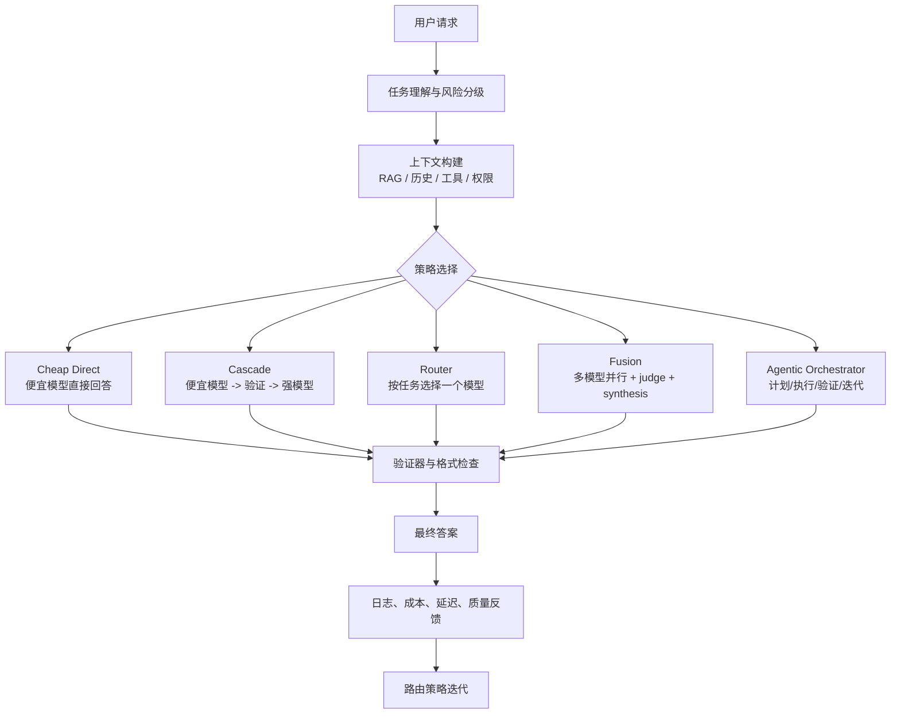
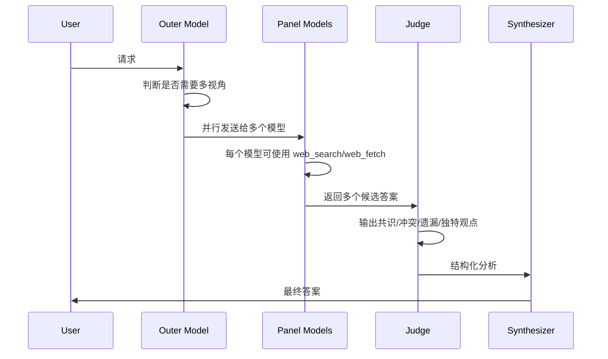
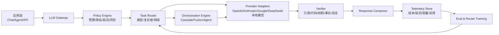

# 统一入口多模型编排调研报告：从 Router、Cascade 到 Fusion 与 Fugu

报告日期：2026-06-28  
适用场景：给业务/技术领导解释“是否应该用一个统一入口组合多个模型，以超过单体强模型，或在同等任务下用便宜模型降低成本”  
结论级别：方向明确成立，但不同目标对应不同技术路线；Fugu 与 Fusion 是同一趋势下的两种不同产品化路径

---

## 0. 一页结论

### 0.1 最重要判断

统一入口组合多个模型不是一个单一技术，而是一组策略：

1. **统一网关**：把不同模型封装成一个入口，主要解决接入、治理、可观测性，不直接提升质量。
2. **模型路由 Router**：每次请求只选一个模型，核心目标是“同等质量下更便宜”。
3. **级联 Cascade**：便宜模型先答，不确定或高风险时升级强模型，核心目标是“降低平均成本”。
4. **多模型融合 Fusion / Ensemble**：多个模型并行回答，再由 judge/synthesizer 比较、合成，核心目标是“在高价值复杂任务上超过单模型”。
5. **学习型编排 Orchestrator**：把拆任务、选模型、调用工具、验证、合成训练成一个系统能力，Fugu 属于这个方向。

所以，要回答领导的问题，不能只说“多模型更强”。准确说法是：

> 对简单和中等任务，用路由/级联降本；对复杂、高价值、开放式任务，用并行融合提质；对长周期任务，用学习型编排提高持续推进能力。一个成熟系统应该按任务动态选择策略，而不是所有请求都 Fusion。

### 0.2 是否能超过强单体模型？

可以，但只在部分任务上成立，典型是：

- 深度研究、竞品分析、法律/医疗/金融等需要多视角论证的任务。
- 复杂代码审查、架构决策、论文复现、数据科学探索。
- 需要事实查证、来源交叉验证、发现盲点的开放问题。
- 一个模型容易遗漏细节、另一个模型能补全的任务。

不适合的任务：

- 简单分类、抽取、格式转换。
- 强约束低延迟交互。
- 答案空间很小且强模型已接近满分的任务。
- judge 无法可靠判断对错的任务。

### 0.3 是否能降低成本？

可以，但靠的主要不是 Fusion，而是 Router/Cascade：

```text
单一强模型成本 = C_strong

路由/级联平均成本 =
C_router
+ P_easy * C_cheap
+ P_hard * (C_cheap + C_strong)
```

只要简单任务占比高、便宜模型通过率高、失败检测可靠，平均成本就能显著下降。FrugalGPT 论文报告了在某些设置下匹配最佳单模型性能同时最多降低 98% 成本；RouteLLM 报告在部分情况下超过 2 倍成本下降而不明显牺牲质量。实际业务中不要直接套论文数字，应先用自有任务集复测。

### 0.4 Fugu 与 Fusion 的本质差异

| 维度 | Sakana Fugu | OpenRouter Fusion |
|---|---|---|
| 产品形态 | 一个像单模型一样调用的多智能体编排模型 | 一个运行时多模型 panel + judge 的服务能力 |
| 核心思想 | 训练一个 orchestrator，让它学会动态拆任务、选模型、协作和合成 | 请求时让多个模型并行作答，由 judge 输出共识、分歧、盲点，再生成最终答案 |
| 最适合 | 长任务、多步骤、agentic workflow、代码审查、研究复现 | 深度研究、专家评审、对比分析、需要多视角的高价值问题 |
| 成本逻辑 | Fugu Ultra 固定价格；Fugu 按底层池中最高档模型单一费率，不叠加每个 agent 费用 | N 个 panel 调用 + 1 个 judge 调用 + 外层请求；默认 3 模型 panel 约为单次 completion 的 4-5 倍成本 |
| 可控性 | 对 Fugu 可 opt out 部分 agent；Fugu Ultra agent pool 固定；底层路由不暴露 | 可配置 panel 模型、judge、max_tool_calls 等；仍依赖 OpenRouter 的实现 |
| 风险 | 编排策略黑盒、供应商自测需复验、区域可用性和合规限制 | 成本/延迟线性增长、judge 质量决定上限、panel 共同错误会被放大 |

### 0.5 给领导的建议

建议采用三阶段路线：

1. **第一阶段：统一模型入口 + 成本路由**
   - 目标：把模型调用、成本、延迟、质量反馈统一记录。
   - 快速收益：把简单任务从强模型迁移到便宜模型。

2. **第二阶段：高价值任务启用 Fusion 模式**
   - 目标：只对复杂研究/决策类任务开启多模型评议。
   - 重点：评估“每多花 4-5 倍推理成本，是否节省更多人力或减少错误损失”。

3. **第三阶段：建设内部 Orchestrator**
   - 目标：基于真实任务日志、偏好数据和评测集，训练或规则化内部路由/编排策略。
   - 长期护城河：不是接入多少模型，而是我们知道哪些任务该用哪个策略，并能持续评估。

---

## 1. 背景：为什么“单体最强模型”不一定是最优解

### 1.1 模型能力正在分化

不同模型在不同任务上呈现专长差异：

- 有的模型擅长代码。
- 有的模型擅长长文综合。
- 有的模型擅长工具调用。
- 有的模型便宜且响应快。
- 有的模型在中文、数学、视觉、检索增强等场景表现更好。

因此，企业真正要优化的不是“单次回答是否最聪明”，而是：

```text
业务可接受质量 / 平均成本 / 平均延迟 / 可审计性 / 稳定性
```

单体强模型在复杂任务上很强，但它有几个结构性问题：

- 简单任务也按强模型价格付费。
- 单模型错误模式不可避免，且很难从内部发现。
- 供应商锁定强。
- 某些模型在特定领域不一定是最优。
- 在长任务中，单模型可能迷失目标、遗漏步骤或无法稳定自检。

### 1.2 多模型系统解决的是“系统优化”问题

一个成熟的多模型系统更像调度平台，而不是把多个模型简单拼起来。它需要回答：

- 当前任务是什么类型？
- 对质量、成本、延迟、隐私的要求分别是什么？
- 是否需要搜索、工具、代码执行、数据库查询？
- 便宜模型是否足够？
- 如果答案不确定，如何检测？
- 如果多个模型观点冲突，谁来判断？
- 如何记录最后为什么选了这个模型？

这也是 Fugu 和 Fusion 出现的背景：市场不再满足于“调用一个最强模型”，开始把 AI 能力产品化为“模型团队”或“模型编排系统”。

---

## 2. 技术路线全景

### 2.1 五类路线

| 路线 | 每次调用几个模型 | 主要目标 | 典型代表 | 优点 | 缺点 |
|---|---:|---|---|---|---|
| Gateway | 1 | 统一接入和治理 | LiteLLM、OpenRouter 基础路由、自建网关 | 快速接入、统一日志、可控 | 不自动提升质量 |
| Router | 1 | 质量/成本最优选择 | RouteLLM、RouterBench 研究线 | 降本明显、延迟低 | 路由错误会影响质量 |
| Cascade | 1 到多个，顺序调用 | cheap-first 降本 | FrugalGPT | 成本弹性好 | 需要可靠置信度/失败检测 |
| Fusion / Ensemble | 多个，并行或分层 | 复杂任务提质 | OpenRouter Fusion、LLM-Blender、MoA | 多视角、能发现盲点 | 成本和延迟上升 |
| Learned Orchestrator | 动态多个 | 学习式任务拆解/协作 | Sakana Fugu | 长任务能力强，用户侧像单模型 | 黑盒、训练和评测复杂 |

### 2.2 统一入口下的推荐架构



### 2.3 关键不是“多数投票”

多模型融合常被误解为“让三个模型投票”。这不够。

更成熟的 Fusion 应该包括：

- **独立生成**：不同模型或同一模型不同采样路径先独立作答。
- **结构化比较**：找出共识、分歧、遗漏、独特洞察。
- **证据约束**：要求模型引用可核查来源或运行工具验证。
- **合成重写**：不是机械拼接，而是基于分析形成最终答案。
- **失败降级**：部分模型失败时仍能使用剩余结果。

OpenRouter Fusion 的设计正是这个思路：panel 并行回答，judge 返回结构化分析，包括 consensus、contradictions、partial coverage、unique insights、blind spots，再由外层模型生成最终答案。

---

## 3. 为什么多模型能更强：机制解释

### 3.1 能力互补

如果模型 A 擅长事实检索，模型 B 擅长推理，模型 C 擅长表达结构，那么融合系统可以把三者优势合成。

这在开放式任务尤其明显。比如调研报告、法律风险分析、论文复现、架构评审，单模型很容易：

- 漏掉某个重要角度。
- 对来源可信度判断不足。
- 过度自信。
- 没有指出反方观点。

多模型 panel 的价值是扩大候选答案空间。

### 3.2 错误去相关

Fusion 有效的前提是各模型错误模式不完全相同。

如果三个模型都因为同一搜索结果误导、同一 benchmark 泄漏、同一训练语料偏差而出错，多模型不会自动变好，甚至会让错误更有“共识感”。因此，多模型系统要关注：

- 模型来源多样性。
- 搜索和引用来源的独立性。
- judge 是否能识别冲突。
- 是否有外部验证器，而不只靠另一个 LLM。

### 3.3 搜索空间扩展

复杂推理题或开放研究题常有多条路径。一次强模型调用可能只探索一条路径。多模型并行相当于同时探索多条路径，再由合成器选择和整合。

这也是 OpenRouter Fusion 博客中“同一个模型与自己融合也能提升”的解释：同一模型不同运行会产生不同推理路径、工具调用和资料选择。多样性不只来自模型架构，也来自采样和工具轨迹。

### 3.4 自检与验证

单模型“自己检查自己”的效果有限。多模型系统可以引入：

- 另一个模型批判。
- 专门 verifier 检查引用、公式、代码运行结果。
- 结构化 rubric 评分。
- 人类偏好数据闭环。

不过，judge 不是万能的。judge 能力不足时，错误答案可能被包装得更像正确答案。因此重要任务不能只靠“看起来更完整”，要有可验证证据。

---

## 4. 为什么多模型能更便宜：机制解释

### 4.1 降本来自“按需使用强模型”

企业任务通常呈长尾分布：

- 大量请求很简单：摘要、格式化、抽取、改写、分类。
- 少数请求很复杂：推理、研究、决策、代码、疑难问题。

如果所有请求都用最强模型，会为简单任务多付费。

### 4.2 Router 的经济账

假设：

- 强模型每次成本：3.00
- 便宜模型每次成本：0.20
- 路由器成本：0.01
- 70% 任务可由便宜模型完成
- 30% 任务需要强模型

使用 cheap-first cascade：

```text
平均成本 = 0.01 + 0.70 * 0.20 + 0.30 * (0.20 + 3.00)
        = 1.11
```

相比全部使用强模型：

```text
成本下降 = (3.00 - 1.11) / 3.00 = 63%
```

这个公式比任何厂商宣传都重要。领导问“能省多少钱”，应该回答：

> 不取决于模型列表，取决于我们的任务分布、便宜模型通过率、失败检测准确率，以及升级策略。

### 4.3 FrugalGPT 与 RouteLLM 的研究支撑

FrugalGPT 提出 prompt adaptation、LLM approximation、LLM cascade 三类降本策略，并报告在实验中可匹配最佳单体模型性能同时最多降低 98% 成本，或在同等成本下提升准确率。

RouteLLM 研究的是用偏好数据训练 router，在强弱模型之间动态选择。论文报告在部分 benchmark 上能超过 2 倍降低成本而不明显牺牲响应质量。

RouterBench 则指出，需要标准化评估多 LLM 路由系统，并提供超过 405k 条模型推理结果来研究路由策略。

这些研究共同说明：降本不是幻想，但必须通过业务评测集验证，不能直接把论文数字当成本公司 ROI。

---

## 5. Fugu 深度拆解

### 5.1 Fugu 是什么

Sakana Fugu 的定位是“Multi-Agent System as a Model”：用户从外部像调用单个模型一样调用 Fugu，但内部是一个多模型/多 agent 编排系统。

其官方描述的核心机制：

- 用户请求进入单一 OpenAI-compatible API。
- Fugu 判断任务该直接解，还是组装专家模型团队。
- 内部管理模型选择、任务委派、验证、合成。
- Fugu 本身也是语言模型，专门学习何时委派、agent 如何沟通、如何合成答案。
- 技术报告称其训练范式包含大规模微调、进化算法、强化学习等。

### 5.2 Fugu 与普通路由器的区别

普通 router 通常只回答：“这次该用哪个模型？”

Fugu 更接近回答：

- 这是不是一个多步骤任务？
- 应该拆成哪些子任务？
- 需要哪些 agent？
- agent 之间如何通信？
- 结果如何验证？
- 最终如何合成？

因此 Fugu 不是单纯“模型选择器”，而是学习型 orchestrator。

### 5.3 Fugu 产品形态

根据 Sakana 官方页面，Fugu 有两个模型：

| 模型 | 定位 | 使用场景 |
|---|---|---|
| Fugu | 平衡性能和低延迟 | 日常编码、代码审查、聊天机器人、交互服务 |
| Fugu Ultra | 质量优先 | 困难多步骤问题、论文复现、安全分析、文献/专利调查、Kaggle 等 |

共同点：

- 都通过一个 OpenAI-compatible API 访问。
- 用户侧无需自己实现多 agent 系统。
- Fugu 支持对特定 agent/provider/model opt out，以满足数据、隐私、合规需求。
- Fugu Ultra 为保证性能，agent pool 固定。
- Fugu 不暴露每次实际使用了哪些底层模型，也不暴露协调方式。

### 5.4 Fugu 的定价逻辑

Sakana 官方页面给出的要点：

- 订阅计划：Standard、Pro、Max。
- Pay-as-you-go：按 token 计费。
- Fugu 按底层 agent pool 中最高档模型的单一费率计费，不把多个 agent 费用相加。
- Fugu Ultra `fugu-ultra-20260615` 标价为每 1M tokens：input $5、output $30、cached input $0.50。
- 超过 272K context 时费率更高：input $10、output $45、cached input $1.00。

这和 Fusion 的经济模型很不一样。Fugu 更像厂商把内部多 agent 成本打包成单一价格；Fusion 更像显式多次调用，成本随 panel 数量线性增长。

### 5.5 Fugu 的强项

Fugu 最适合：

- 长链路任务，不只是单轮问答。
- 需要持续推进、实验、修正、再验证的任务。
- 代码审查、自动研究、论文复现、数据科学实验。
- 用户希望一个模型名就能使用多 agent 能力，不想自己搭编排系统。
- 企业希望降低单一模型供应商依赖。

### 5.6 Fugu 的主要风险

1. **黑盒程度高**
   - 用户看不到实际底层模型和路由路径。
   - 出错后较难定位是哪个 agent、哪一步、哪段资料导致。

2. **评测需要复验**
   - 官方 benchmark 是重要参考，但不等于独立审计。
   - 官方也说明部分对比基线来自模型提供方公开分数，未必全部在同一环境复测。

3. **供应链与合规**
   - Fugu 本质上仍可能调用多个外部模型。
   - 对敏感数据，需要确认数据驻留、日志、训练使用、agent opt-out 是否满足公司要求。

4. **成本不可完全解释**
   - 虽然不叠加 agent 费用，但实际内部调用深度不透明。
   - 对预算治理，需要依赖 token 上限、请求分级和使用策略。

### 5.7 对 Fugu 的判断

Fugu 是“把多模型编排能力训练成一个可调用模型”的方向，长期潜力很高。它适合作为高难任务的外部能力供应商，尤其在企业还没有内部 orchestration 数据和工程能力时。

但如果公司希望掌握长期主动权，不应只买 Fugu，而应同时建设自己的统一网关、评测集和路由日志。否则，未来很难判断 Fugu 什么时候真的比自建 router/Fusion 更划算。

---

## 6. Fusion 深度拆解

### 6.1 Fusion 是什么

OpenRouter Fusion 是一个多模型 deliberation 能力。它有几种入口：

- `model: "openrouter/fusion"`：像调用一个模型一样调用 Fusion。
- `tools: [{ "type": "openrouter:fusion" }]`：把 Fusion 作为 server tool 给外层模型使用。
- `plugins: [{ "id": "fusion", ... }]`：通过 plugin 配置 panel 和 judge。
- Chatroom/Lab：在 UI 中选择 preset 或自定义 panel。

### 6.2 Fusion 的工作流



Fusion 不是简单投票，而是：

- panel 模型并行回答。
- judge 比较回答，不只是拼接回答。
- judge 输出结构化 JSON：共识、矛盾、部分覆盖、独特洞察、盲点。
- 外层模型基于分析写最终答案。

### 6.3 Fusion 的配置能力

OpenRouter 文档显示，Fusion 可配置：

| 参数 | 含义 |
|---|---|
| `analysis_models` | panel 模型，默认 Quality preset，包括 Anthropic、OpenAI、Google 的 latest/pro/latest 别名；允许 1-8 个模型 |
| `model` | judge 模型 |
| `max_tool_calls` | 每个 panel 模型和 judge 可使用 web_search/web_fetch 的最大步数，默认 8，范围 1-16 |
| `max_completion_tokens` | 限制内部 panel/judge 输出 |
| `reasoning` | 给内部调用传递 reasoning 配置 |
| `temperature` | panel 温度；judge 温度固定为 0 |

### 6.4 Fusion 的成本与延迟

OpenRouter 文档明确说明：

```text
Fusion 成本 = N 个 panel 调用 + 1 个 judge 调用 + 正常外层请求
```

默认 3-model panel 时，预计约为同一 prompt 单次 completion 的 4-5 倍成本，且成本随 panel size 线性增长。

OpenRouter 博客 FAQ 还指出，Fusion 被调用时通常比标准调用长 2-3 倍，因为要发送给多个模型、等待结果、再处理合成。

因此，Fusion 的商业逻辑不是“降本”，而是：

> 在错误代价高或人工研究成本高的任务上，用更高推理成本换更高答案质量、更多盲点发现和更低决策风险。

### 6.5 Fusion 的公开效果

OpenRouter 在 2026-06-12 博客中报告：

- 在 DRACO 100 个深度研究任务上，模型 panel 常常超过单模型。
- Fable 5 + GPT-5.5 由 Opus 4.8 合成得分 69.0%，超过 Fable 5 单模型 65.3%。
- Opus 4.8 + GPT-5.5 + Gemini 3.1 Pro 得分 68.3%。
- 预算 panel（Gemini 3 Flash、Kimi K2.6、DeepSeek V4 Pro）得分 64.7%，高于 GPT-5.5 单模型 60.0% 和 Claude Opus 4.8 单模型 58.8%。
- 他们也说明 Fable 5 有 7/100 个任务因内容过滤未完成，因此某些对比不是完全均匀。
- DRACO 本身也有限制：文本、英文、静态任务集，且绝对分数依赖 judge 模型。

这组数据可以说明方向，但不能直接视为“Fusion 已普遍超过 frontier model”。正确表述应是：

> 在 OpenRouter 公开的 DRACO 实现中，Fusion panel 在深度研究任务上表现出超过若干单模型基线的结果；但这是厂商自测，需要用企业自有任务集复验。

### 6.6 Fusion 的强项

Fusion 最适合：

- 需要多专家观点的研究题。
- 需要对比利弊、发现争议点的问题。
- 不确定性高但不能轻易错的问题。
- 高价值报告、战略分析、技术选型、竞品分析。
- 单模型输出容易“完整但片面”的任务。

### 6.7 Fusion 的短板

1. **成本高**
   - 默认约 4-5 倍单次 completion。
   - 如果每个 panel 又使用 web 工具，实际成本和延迟更高。

2. **延迟高**
   - 需要等待最慢 panel 模型。
   - 不适合低延迟聊天、在线客服、实时交互。

3. **judge 是瓶颈**
   - judge 不能识别的错误仍可能进入最终答案。
   - judge 的偏好可能偏向表达更强但事实更弱的答案。

4. **共同污染风险**
   - 如果所有模型都搜索到同一错误来源，Fusion 可能形成错误共识。
   - benchmark rubric 泄漏也是 OpenRouter 博客中提到的实际风险。

### 6.8 对 Fusion 的判断

Fusion 是高价值复杂任务的“按需专家委员会”，不是通用替代模型。最佳用法不是把所有请求都切到 `openrouter/fusion`，而是让外层模型或路由器在任务足够复杂时再调用 Fusion。

---

## 7. Fugu 与 Fusion 对比剖析

### 7.1 共同趋势

Fugu 和 Fusion 说明行业正在从“单模型竞争”转向“复合 AI 系统竞争”：

- 用户仍希望一个入口。
- 系统内部可以有多个模型、多个工具、多个步骤。
- 价值从“模型参数规模”迁移到“任务调度、工具使用、验证、合成、成本控制”。

### 7.2 关键差异

| 问题 | Fugu 的答案 | Fusion 的答案 |
|---|---|---|
| 谁决定调用哪些模型？ | Fugu 编排模型内部决定 | 用户配置 panel，或 OpenRouter preset 决定；外层模型决定是否调用 |
| 是否训练过编排策略？ | 是，官方称通过微调、进化、强化学习等训练 orchestrator | 主要是运行时 pipeline，不强调训练一个专用 orchestrator |
| 用户能否看到内部模型？ | 不能看到具体路由 | 可配置/看到 panel；但实际执行仍依赖 OpenRouter |
| 成本如何计算？ | 打包式/单一费率，不叠加 agent 费用 | 多次调用相加，随 panel 大小线性增长 |
| 最像什么？ | 一个会组织专家团队的项目经理 | 一个可配置专家评审会 |
| 最适合什么？ | 长流程 agentic work | 单次复杂研究/分析 |

### 7.3 战略含义

如果领导问“我们要学 Fugu 还是 Fusion”，答案是：

> 短期学习 Fusion 的可解释架构，中期落地 router/cascade 降本，长期积累数据后再学习 Fugu 式 orchestrator。

原因：

- Fusion 的结构更透明，便于复现和实验。
- Router/Cascade 更容易先产生成本收益。
- Fugu 式学习型编排需要大量数据、评测、训练和线上反馈，不适合作为第一步。

---

## 8. 企业落地方案

### 8.1 推荐系统架构



### 8.2 入口层能力清单

统一入口至少要具备：

- Provider adapter：不同供应商 API 差异屏蔽。
- Model registry：模型价格、上下文长度、能力标签、可用区域、隐私级别。
- Routing policy：按任务、预算、用户等级、风险选择策略。
- Cost guardrail：单请求预算、单用户预算、单项目预算。
- Latency budget：同步/异步模式、超时、降级。
- Observability：记录 request id、model、tokens、cost、latency、error、route。
- Eval hook：抽样进入离线评测或人工复核。
- Compliance policy：敏感数据不能出境、不能进某些 provider、训练使用 opt-out。

### 8.3 策略选择规则

| 任务类型 | 默认策略 | 升级条件 |
|---|---|---|
| 分类/标签/路由 | cheap direct | 低置信度或高风险 |
| 摘要/改写 | cheap direct 或 specialist | 长文、专业领域、用户 VIP |
| 一般问答 | router | 检索失败、涉及决策 |
| 代码补全 | specialist coding model | 编译失败、测试失败 |
| 代码审查 | strong model + verifier | 高风险模块启用 Fusion/Fugu |
| 深度研究 | Fusion / research agent | 需要长周期执行时用 Fugu/agent |
| 合规/法律/医疗 | strong + evidence + human-in-loop | 不建议纯自动闭环 |

### 8.4 MVP 推荐

第一版不要做太复杂。建议实现 4 条路径：

1. **cheap_direct**
   - 处理简单、低风险请求。

2. **strong_direct**
   - 处理明确困难或高风险请求。

3. **cheap_then_strong**
   - 便宜模型回答后，由 verifier 判断是否升级。

4. **fusion_mode**
   - 只在深度研究/技术选型/复杂分析中使用。

### 8.5 评测设计

要证明这个方向值得投，必须有内部评测集。

建议抽取 200-500 个真实任务，按类别分层：

- 简单格式化/抽取：50
- 业务问答：50
- 技术问答：50
- 代码/SQL：50
- 深度研究/分析：50
- 高风险/边界案例：50

每个任务记录：

- 输入。
- 标准答案或评分 rubric。
- 可接受延迟。
- 可接受成本。
- 是否允许外部模型。
- 是否需要引用来源。
- 失败是否严重。

评价指标：

| 指标 | 含义 |
|---|---|
| accepted answer rate | 人或评测器认为可接受的比例 |
| win rate vs strong model | 相比单一强模型的胜率 |
| cost per accepted answer | 每个可接受答案的成本 |
| P50/P95 latency | 中位/尾部延迟 |
| escalation rate | 从 cheap 升级 strong 的比例 |
| false cheap rate | 本该强模型但被 cheap 接住导致失败的比例 |
| citation correctness | 引用是否真实支持答案 |
| incident rate | 幻觉、违规、格式错误、工具失败 |

### 8.6 通过标准

建议设置两个不同目标：

**降本目标**

- 在总体 accepted answer rate 不下降超过 1-2 个百分点的前提下，平均成本下降 30-50%。
- P95 延迟不高于当前方案 1.5 倍。

**提质目标**

- 在高价值复杂任务中，相比单强模型 win rate 至少提升 5-10 个百分点。
- 或者人工评审认为“可直接交付”的比例提升 10 个百分点以上。
- 允许成本增加，但需要换算成人工时间节省或错误风险下降。

---

## 9. 领导可能追问的问题与回答

### Q1：这是不是只是把多个模型接到一个网关？

不是。网关只解决接入和治理；真正的价值来自路由、级联、融合、验证、反馈闭环。没有这些，统一入口只是 API 聚合。

### Q2：为什么不一直用最强模型？

因为企业请求大多不是最高难度。简单任务用强模型是浪费；复杂任务单强模型又可能遗漏视角。最佳策略是按任务动态选择。

### Q3：多模型一定比单模型强吗？

不一定。只有在模型能力互补、错误不完全相关、judge 可靠、任务需要多视角时才可能更强。简单任务或低延迟任务反而不适合。

### Q4：Fusion 能降本吗？

通常不能。Fusion 默认 3 模型 panel 约 4-5 倍单次 completion 成本。Fusion 的价值是提质，不是降本。降本主要靠 router/cascade。

### Q5：那 OpenRouter 说预算模型 panel 超过 GPT-5.5，是否说明可以又便宜又强？

只能说明在其 DRACO 深度研究实现中，一个预算 panel 达到了高于部分单模型的结果。它仍是多次调用，成本要按 panel + judge 算；是否比单强模型更便宜，要看所选模型价格、工具调用和任务长度。不能泛化到所有任务。

### Q6：Fugu 和 Fusion 哪个更值得关注？

都值得关注，但关注点不同。Fusion 更适合作为我们理解和复现多模型评议的参考；Fugu 代表更长期的学习型编排方向。短期落地应先做可控的 router/cascade 和按需 Fusion。

### Q7：Fugu 是否就是更好的 Fusion？

不准确。Fugu 是训练出来的 orchestrator，内部可以动态组织 agent；Fusion 是显式 panel + judge pipeline。Fugu 更像项目经理，Fusion 更像专家评审会。

### Q8：我们能不能自己做一个 Fugu？

短期可以做规则版 orchestrator，但真正 Fugu 式学习型编排需要大量任务轨迹、偏好标注、评测集、强化学习或进化搜索，以及稳定的工具执行环境。建议先积累数据，不要一开始就训练。

### Q9：如何避免多模型互相放大错误？

要做四件事：

- 使用来源和模型多样化。
- 要求引用或工具验证。
- judge 输出分歧和盲点，不只输出结论。
- 对高风险任务加入 deterministic verifier 或人工复核。

### Q10：如果 judge 错了怎么办？

judge 是系统瓶颈。可以用多 judge、rubric judge、引用验证、代码执行、单元测试、人工抽检来降低风险。不要把 judge 当成绝对真理。

### Q11：怎么证明对我们公司有价值？

用内部任务集 A/B 测试：

- 单强模型 baseline。
- cheap router/cascade。
- Fusion mode。
- Fugu 或外部 orchestrator。

比较 accepted answer rate、win rate、成本、延迟、人工节省。

### Q12：这会不会让系统不可控？

如果直接使用黑盒 Fugu，确实可解释性较弱。如果自建 gateway + policy + logs，可以把不可控部分限制在模型输出层，并保留审计、回放和降级能力。

### Q13：合规风险在哪里？

最大风险是敏感数据被发送到不合适的 provider。需要模型 allowlist/denylist、数据分级、区域限制、训练使用 opt-out、审计日志和供应商协议。

### Q14：延迟怎么处理？

简单任务走 direct/router。Fusion 只用于异步或可等待的任务。对同步场景设置 timeout 和 fallback。长任务用任务队列，不要阻塞用户。

### Q15：如果外部模型涨价或不可用怎么办？

统一入口的价值之一就是可替换。模型 registry 应维护价格、可用性、能力标签；路由策略应支持 fallback provider。

### Q16：是否需要引入开源模型？

需要考虑，但不是为了“开源而开源”。开源模型适合隐私敏感、成本可控、可微调场景；但在高难任务上不一定便宜，因为自托管 GPU、运维、吞吐也有成本。

### Q17：多模型系统的护城河是什么？

不是“接了多少模型”，而是：

- 真实任务数据。
- 任务分布理解。
- 质量评测集。
- 失败检测。
- 成本/质量路由策略。
- 用户反馈闭环。
- 领域工具和知识库。

### Q18：什么时候应该买，什么时候应该自建？

早期买外部能力做 benchmark 和探索；核心生产流量应经过自建 gateway。长期把路由、日志、评测、策略掌握在自己手里。

### Q19：这个方向会不会被下一个更强单体模型取代？

不会完全取代。更强单体模型会抬高 baseline，但任务路由、成本优化、工具调用、合规治理仍然需要系统层能力。强模型也可以成为多模型系统中的一个 agent。

### Q20：我们下一步怎么做？

用 4-6 周做 PoC：

1. 搭统一 gateway。
2. 选 3-5 个模型。
3. 建 200 个内部评测任务。
4. 实现 cheap direct、cascade、strong direct、fusion mode。
5. 输出成本/质量/延迟报告。
6. 决定是否扩大到生产。

---

## 10. 4-6 周 PoC 计划

### 第 1 周：评测集和基线

- 收集真实任务样本。
- 标注任务类型、风险等级、理想答案或评分 rubric。
- 跑单强模型 baseline。
- 记录成本、延迟、质量。

### 第 2 周：统一入口

- 接入 3-5 个模型。
- 建 model registry。
- 实现统一日志、成本统计、错误处理。
- 加入 provider allowlist/denylist。

### 第 3 周：Router/Cascade

- 先用规则路由：
  - 简单抽取/改写走 cheap。
  - 代码走 coding specialist。
  - 高风险走 strong。
  - 深度研究走 fusion。
- 加入 cheap answer verifier。
- 评估成本下降和质量损失。

### 第 4 周：Fusion/Fugu 对比

- 对深度研究、技术选型、代码审查任务测试：
  - 单强模型。
  - 自建 Fusion panel。
  - OpenRouter Fusion。
  - Sakana Fugu/Fugu Ultra，如可用。
- 人工盲评输出质量。

### 第 5-6 周：策略固化

- 确定上线策略。
- 定义预算阈值。
- 定义哪些任务允许 Fusion/Fugu。
- 输出决策报告：降本多少、提质多少、延迟代价、合规风险。

---

## 11. 建议汇报口径

### 11.1 30 秒版

多模型统一入口不是简单接多个 API，而是把任务按复杂度、成本、风险动态分发。简单任务用便宜模型降本，复杂任务用多模型评议提质，长任务用编排系统持续推进。Fugu 代表训练型 orchestrator，Fusion 代表运行时专家 panel。我们建议先做统一入口和 router/cascade，把成本收益拿到，再对高价值任务引入 Fusion/Fugu。

### 11.2 3 分钟版

现在模型之间能力分化明显，没有一个模型在所有任务上都是成本和质量最优。企业侧真正需要优化的是“可接受质量下的平均成本和稳定性”。  

多模型系统有两条主线：一条是 router/cascade，用便宜模型处理简单任务，失败或高风险时升级强模型，这条线主要降本；另一条是 Fusion/Orchestrator，让多个模型并行分析、互相补充，再由 judge 合成，这条线主要提质。  

Fugu 和 Fusion 是这个方向的两个最新代表。Fusion 是显式 panel + judge，适合深度研究，但默认成本约 4-5 倍单次调用；Fugu 是训练出的编排模型，用户像调一个模型一样使用，内部动态调用 agent，更适合长任务和复杂工作流，但路由细节黑盒。  

我们的建议是不要一开始押注某个黑盒产品，而是先建设自己的统一入口、评测集、日志和路由策略。第一阶段用 router/cascade 降本，第二阶段对复杂任务按需开启 Fusion，第三阶段用真实反馈训练或优化内部 orchestrator。

### 11.3 一句话战略判断

> 大模型应用的下一阶段竞争，不只是模型本身，而是“谁能以最低成本、最高可靠性，把合适的模型和工具组合到合适的任务上”。

---

## 12. 资料可信度分级

| 来源类型 | 示例 | 可用于什么 | 注意事项 |
|---|---|---|---|
| 学术论文 / arXiv | FrugalGPT、RouteLLM、RouterBench、LLM-Blender、MoA、DRACO、Fugu Technical Report | 技术机制、实验趋势、方法定义 | 部分未正式同行评审；实验设置不等同业务场景 |
| 官方文档 | OpenRouter Fusion Docs、Sakana Fugu Product Page | 产品机制、参数、定价、限制 | 价格和功能可能变化 |
| 厂商博客 | OpenRouter Fusion benchmark、Sakana Fugu release | 最新产品声称和案例 | 自测结果需复验 |
| 内部评测 | 公司真实任务集 | 决策依据 | 需要严谨抽样和盲评 |

---

## 13. 关键资料链接

- Sakana Fugu 产品页：https://sakana.ai/fugu/
- Sakana Fugu 发布文：https://sakana.ai/fugu-release/
- Sakana Fugu Technical Report：https://arxiv.org/abs/2606.21228
- OpenRouter Fusion Router 文档：https://openrouter.ai/docs/guides/routing/routers/fusion-router
- OpenRouter Fusion Server Tool 文档：https://openrouter.ai/docs/guides/features/server-tools/fusion
- OpenRouter Fusion 发布博客：https://openrouter.ai/blog/announcements/fusion-beats-frontier/
- DRACO benchmark：https://arxiv.org/abs/2602.11685
- FrugalGPT：https://arxiv.org/abs/2305.05176
- RouteLLM：https://arxiv.org/abs/2406.18665
- RouterBench：https://arxiv.org/abs/2403.12031
- LLM-Blender：https://arxiv.org/abs/2306.02561
- Mixture-of-Agents：https://arxiv.org/abs/2406.04692

---

## 14. 最终建议

不要把这个方向定义成“我要做一个比 GPT-5.5 更强的模型”。更务实也更有商业价值的定义是：

> 建设一个统一 AI 推理入口，在每个请求上动态选择 direct、router、cascade、fusion 或 orchestrator 策略，使总体成本下降，并在高价值任务上获得超过单模型的质量。

短期价值来自降本，中期价值来自复杂任务提质，长期价值来自内部评测与路由数据形成的系统护城河。

对领导汇报时，建议明确三件事：

1. **多模型不是银弹**：简单任务不要 Fusion，复杂任务才值得。
2. **降本和提质是两套机制**：router/cascade 降本，fusion/orchestrator 提质。
3. **公司自己的评测集是决策核心**：没有内部 benchmark，就无法判断 Fugu、Fusion 或自建方案谁更适合。

---

## 15. 深度版补充：把研究结论转成采用门槛

### 15.1 最容易犯的三个判断错误

**错误一：把 Fusion 当降本工具。**  
Fusion 的默认形态是多模型并行 + judge/synthesis，成本和延迟通常上升。它的合理目标是让高价值任务更可靠、更完整、更能发现盲点。若目标是降低平均调用成本，应优先做 router/cascade。

**错误二：把 Fugu 当普通模型替换。**  
Fugu 的价值不在“又一个更强模型”，而在把多 agent 编排封装成单模型 API。它应该和强单体模型、Fusion panel、内部 agent workflow 放到同一评测集比较，而不是只看公开 benchmark。

**错误三：把 benchmark 分数当生产结论。**  
DRACO、RouterBench、AlpacaEval 等能提供方向性证据，但不能替代内部任务集。真正的采用决策要看本公司任务上的事实准确率、引用质量、用户接受率、成本、延迟和失败尾部。

### 15.2 采用 Fusion 的门槛

Fusion 适合进入生产灰度，至少要满足：

| 门槛 | 判断标准 |
|---|---|
| 任务价值足够高 | 多花数倍推理成本仍低于人工返工或错误损失 |
| 候选有互补性 | panel 输出不是同质复述，而是覆盖不同证据、角度或风险 |
| judge 可审计 | 能看到共识、冲突、盲点、引用和最终合成理由 |
| 质量提升可复验 | 在内部 rubric 上超过 strong direct，而不只是答案更长 |
| 失败可降级 | panel 超时、模型失败或 judge 不确定时有 fallback |

不满足这些条件时，应先把 Fusion 留在人工辅助或离线评测环境。

### 15.3 采用 Fugu/Fugu Ultra 的门槛

Fugu 更适合作为 agentic workflow baseline，而不是默认替换所有模型。试用时应重点看：

- 是否显著改善多步骤任务成功率。
- 是否减少人工拆任务、反复提示和手动验证。
- 是否能稳定处理代码、工具、搜索、引用、长上下文。
- 是否有足够日志解释失败来源。
- 是否满足数据区域、隐私和供应商合规要求。
- 成本和延迟是否可预测。

若 Fugu 表现强但轨迹不可解释，建议只用于低敏或人工审核前置的高价值任务，不应直接接管核心生产链路。

### 15.4 内部 PoC 的最低可接受证据

4-6 周 PoC 结束时，不应只输出“模型 A 看起来更好”。至少要能给出：

```text
1. 每类任务的样本数和来源
2. strong direct / cheap direct / cascade / Fusion / Fugu 的质量对比
3. 成本、延迟、超时率、失败率
4. 事实错误、引用错误、格式错误、遗漏关键点的分类统计
5. 人工盲评或业务 owner 复核结果
6. 哪些任务适合默认降本，哪些任务只适合高价值 Fusion
7. 上线后的监控指标和回滚条件
```

这组证据比任何单篇论文数字更重要。

### 15.5 最终执行原则

统一入口的成熟形态应该是：

```text
简单任务：cheap direct 或 cascade
中等任务：preference router
高价值分析：selective Fusion
长周期任务：workflow orchestrator / Fugu-like baseline
高风险任务：strong model + verifier + human-in-loop
```

如果只能先做一件事，优先做统一日志和离线回放。没有这两者，后续所有关于“更便宜”或“更强”的判断都会缺少可复验证据。
