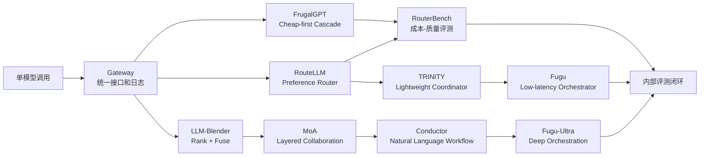

# 多模型编排论文横向总结：方向、差异与对我们的启示

## 1. 总体结论

这 9 篇论文可以分成五条主线：

| 主线 | 代表论文 | 核心问题 |
|---|---|---|
| 学习型编排 | TRINITY、Conductor、Fugu Technical Report | 如何训练一个 orchestrator 动态组织多个模型 |
| 成本优化 | FrugalGPT、RouteLLM、RouterBench | 如何少用强模型、降低平均推理成本 |
| 输出融合 | LLM-Blender、Mixture-of-Agents | 如何把多个模型输出合成更强答案 |
| 深度研究评测 | DRACO | 如何评估复杂研究任务的质量 |
| 产品化系统 | Fugu Technical Report | 如何把多 agent 能力包装成单模型接口 |

它们共同指向一个判断：

> 大模型应用的下一阶段，不是只比较单个模型谁更强，而是比较谁能把模型、工具、数据、评测和成本策略组织成更有效的系统。

## 2. 方向差异

### 2.1 Router/Cascade：目标是降本

代表论文：

- FrugalGPT
- RouteLLM
- RouterBench

核心逻辑：

```text
简单任务 -> 便宜模型
困难任务 -> 强模型
不确定任务 -> 级联升级
```

适合：

- 大规模普通流量。
- 分类、抽取、摘要、改写、常规问答。
- 对延迟敏感、成本敏感的产品。

不适合：

- 单次任务错误代价极高且不能容忍 cheap 误判。
- 需要多模型同时提供视角的复杂研究。

关键启示：

> 降本靠 router/cascade，不靠 Fusion。

### 2.2 Fusion/Ensemble：目标是提质

代表论文：

- LLM-Blender
- Mixture-of-Agents

核心逻辑：

```text
多个模型输出 -> 比较/排序 -> 聚合/融合 -> 最终答案
```

适合：

- 复杂开放问答。
- 研究报告。
- 技术选型。
- 多视角分析。
- 单模型容易遗漏的任务。

不适合：

- 简单任务。
- 低延迟任务。
- 成本极敏感任务。

关键启示：

> Fusion 的价值是质量、覆盖度和盲点发现，不是便宜。

### 2.3 Learned Orchestrator：目标是动态组织能力

代表论文：

- TRINITY
- Conductor
- Fugu

核心逻辑：

```text
任务输入 -> orchestrator -> 选择模型/角色/通信拓扑/工具流程 -> 多 agent 执行 -> 最终结果
```

TRINITY 走有限 action space：

- 选 agent。
- 选角色。
- 用演化策略训练。
- 低延迟、可控、动作空间小。

Conductor 走自然语言 workflow：

- 写子任务 prompt。
- 定义 agent 可见性。
- 动态生成拓扑。
- 用 RL 训练。
- 表达力强，但成本和工程复杂度高。

Fugu 是产品化整合：

- Fugu 低延迟版更像 TRINITY。
- Fugu-Ultra 高质量版更像 Conductor。

关键启示：

> 真正的 Fugu-like 系统不是模型网关，而是经过任务结果训练的 orchestrator。

### 2.4 Benchmark：目标是防止自嗨

代表论文：

- RouterBench
- DRACO

RouterBench 告诉我们：

- router 必须在成本-质量曲线上胜出。
- 要和 zero/interpolation baseline 比。
- 需要同一任务上多个模型的输出和成本。

DRACO 告诉我们：

- deep research 不能只看“答案是否顺眼”。
- 要看事实准确、分析完整、客观表达、引用质量。
- judge 绝对分数会变化，relative ranking 更可靠。

关键启示：

> 没有内部评测集，就无法判断多模型系统是否真的有效。

## 3. 从论文到系统的演进图



## 4. 各论文回答的问题不同

| 论文 | 它真正回答的问题 | 不应该误解为 |
|---|---|---|
| FrugalGPT | 如何在预算下用级联降低成本 | 多模型一定更强 |
| RouteLLM | 如何训练强弱模型 router | 已解决任意多模型编排 |
| RouterBench | 如何评测 router 的成本-质量曲线 | 某个具体 router 是最优 |
| LLM-Blender | 如何排序并融合多个候选输出 | 它能处理长程 agent workflow |
| MoA | 分层多模型聚合能否提升开放生成 | 适合低延迟生产流量 |
| TRINITY | 小 coordinator 能否学习 agent/role 选择 | 自由自然语言编排 |
| Conductor | RL 能否训练模型生成自然语言 workflow | 成本低、延迟低 |
| Fugu | 如何把 learned orchestration 产品化 | 透明可解释的自建系统 |
| DRACO | 如何评估 deep research | 能覆盖所有企业任务 |

## 5. 对 Fugu 的重新理解

Fugu 不是一个孤立产品，而是三层研究的交汇：

1. **RouteLLM/RouterBench/FrugalGPT 层**
   - 说明为什么按任务选择模型有经济价值。

2. **LLM-Blender/MoA 层**
   - 说明多个模型输出可以通过比较和聚合超过单模型。

3. **TRINITY/Conductor 层**
   - 说明编排策略本身可以被训练，而不是永远靠手工 prompt。

Fugu 的价值是把这些能力封装为一个接口：

- 简单任务走低延迟 selection。
- 复杂任务走深度 workflow。
- 用户不需要自己管理 agent pool。

但代价是：

- 路由透明度降低。
- 供应商依赖增强。
- 内部策略不可控。

## 6. 对我们建设系统的启示

### 6.1 不要把目标定义为“做一个 Fusion”

更准确目标应是：

> 做一个统一 AI 推理入口，根据任务动态选择 direct、router、cascade、fusion、orchestration。

因为：

- 所有请求都 Fusion 会太贵太慢。
- 所有请求都 router 会错过复杂任务提质机会。
- 只接 Fugu 会缺乏透明度和内部数据资产。

### 6.2 推荐路线

#### 阶段 1：统一入口和日志

必须先有：

- model registry。
- provider adapter。
- cost logging。
- latency logging。
- task type。
- user feedback。
- failed case collection。

没有这些，后续无法训练 router，也无法评估 Fusion。

#### 阶段 2：Cheap-first cascade

先从 FrugalGPT 路线拿 ROI：

- 低风险任务先走便宜模型。
- verifier 判断是否升级。
- 记录升级率、误判率、成本下降。

核心指标：

```text
cost per accepted answer
false cheap rate
escalation rate
```

#### 阶段 3：Preference router

参考 RouteLLM：

- 收集 strong vs cheap 的偏好数据。
- 训练 strong-wins predictor。
- 用阈值控制成本和质量。

不同业务等级可用不同 threshold：

- 免费用户：更高 cheap 比例。
- 付费用户：更高 strong 比例。
- 高风险任务：直接 strong 或 human-in-loop。

#### 阶段 4：Selective Fusion

参考 LLM-Blender / MoA：

- 只对高价值任务启用。
- panel 不一定都用最贵模型。
- 保留 judge 输出的分歧、盲点和引用。

适合任务：

- 竞品分析。
- 技术方案评审。
- 深度研究。
- 代码审查。
- 高风险决策辅助。

#### 阶段 5：Internal Conductor

等有足够任务轨迹后，再考虑：

- 固定 workflow selector。
- TRINITY-like agent/role selector。
- Conductor-like natural language workflow generator。

不要一开始就训练 orchestrator。先用规则和数据积累。

## 7. 内部评测体系建议

### 7.1 RouterBench-like 评测

每个任务样本保存：

- 输入。
- 每个候选模型输出。
- 每个模型成本。
- 每个模型延迟。
- 人工或 judge 评分。
- 最终用户是否接受。

用于评估：

- 哪个模型在哪类任务上最好。
- router 是否超过固定模型。
- cheap-first 是否降低成本。
- oracle gap 有多大。

### 7.2 DRACO-like 评测

对深度研究类任务，rubric 应至少包含：

- 事实准确性。
- 分析完整性。
- 反方观点。
- 引用真实性。
- 引用是否支持论点。
- 输出结构和可读性。

特别要注意中文业务场景需要自建数据，因为 DRACO 是英文、静态、单轮。

## 8. 技术选型建议

### 8.1 MVP 策略集合

第一版可以只做 5 个策略：

| 策略 | 作用 |
|---|---|
| cheap_direct | 简单低风险任务 |
| strong_direct | 高风险或困难任务 |
| cheap_then_verify | 大规模降本 |
| panel_fusion | 高价值复杂分析 |
| workflow_agent | 长任务、代码、研究 |

### 8.2 不建议第一版做的事

- 不建议训练 Fugu-like orchestrator。
- 不建议所有任务都走 Fusion。
- 不建议只凭模型排行榜选模型。
- 不建议没有评测集就谈 ROI。
- 不建议把 judge 当绝对真理。

### 8.3 应该尽早做的事

- 统一日志。
- 成本归因。
- 模型输出留样。
- 用户反馈。
- 离线评测集。
- 自动回放不同策略。
- 合规 allowlist/denylist。

## 9. 给领导的解释框架

### 30 秒版

这些论文说明，多模型系统有三种价值：router/cascade 降低成本，fusion 提升复杂任务质量，
learned orchestrator 让系统自动组织模型团队。Fugu 是 learned orchestration 的产品化，
TRINITY 和 Conductor 分别提供低延迟 coordinator 和自然语言 workflow 的基础。
但落地不能一步到 Fugu，应该先做统一入口、评测集、降本路由，再逐步引入 Fusion 和内部 orchestrator。

### 3 分钟版

我们要做的不是简单接多个模型，而是建立一个“任务到策略”的决策系统。简单任务用便宜模型，困难任务用强模型，不确定任务用级联，高价值研究任务用多模型融合，长周期任务用 agentic orchestrator。  

FrugalGPT、RouteLLM、RouterBench 证明了路由和级联可以降本，但前提是有任务分布和评测数据。LLM-Blender、MoA 证明多模型融合可以提升开放生成质量，但成本和延迟更高。TRINITY 和 Conductor 进一步说明，编排策略可以被训练出来，而不是永远靠人工 prompt。Fugu 把这两条研究线产品化成一个单模型接口。  

因此我们的建议是：先建设统一入口和内部 benchmark，用 router/cascade 获取成本收益；再对高价值任务引入 Fusion；最后基于自己的日志和偏好数据训练内部 orchestrator。

## 10. 最关键的决策点

### 是否做？

应该做，但目标不是“替代最强模型”，而是“用系统层策略优化成本和质量”。

### 先做什么？

先做 gateway + logging + internal benchmark + cheap-first cascade。

### 什么时候用 Fusion？

只在错误代价高、需要多视角、人工研究成本高的任务使用。

### 什么时候考虑 Fugu？

当我们需要快速获得高质量外部 orchestration 能力时可以试用；但核心路由、日志、评测和策略应掌握在自己系统中。

### 最终护城河是什么？

不是接入模型数量，而是：

- 自有任务数据。
- 偏好和失败样本。
- 成本-质量评测。
- 可解释路由策略。
- 领域工具和知识库。
- 能持续学习的 orchestration loop。

---

## 11. 高质量版横向总结：统一入口真正要优化什么

### 11.1 核心命题

这组论文共同回答的不是“多模型是否比单模型强”这个过于粗糙的问题，而是下面四个更精确的问题：

| 问题 | 最相关论文 | 系统动作 | 成功标准 |
|---|---|---|---|
| 同等质量下如何更便宜？ | FrugalGPT、RouteLLM、RouterBench | router / cascade | 成本-质量曲线优于固定强模型 |
| 高价值任务如何比单模型更完整？ | LLM-Blender、MoA、Fusion 方向 | rank / fuse / aggregate | 事实、覆盖度、盲点发现提升 |
| 长任务如何自动组织模型团队？ | TRINITY、Conductor、Fugu | learned orchestration | 动态选 agent、角色、工具、拓扑 |
| 如何证明不是自我感觉良好？ | RouterBench、DRACO | internal benchmark | 质量、成本、延迟、引用、稳定性可复验 |

因此，统一入口的目标不应写成：

```text
用多个模型超过最强模型
```

更准确的目标是：

```text
在每类任务上选择最低总成本、可接受延迟、可审计质量最优的执行策略。
```

这里的“总成本”不只是 API 价格，还包括用户等待、人工返工、错误损失、合规风险和供应商锁定。

### 11.2 四类路线的边界

#### A. Cost Optimization：Router/Cascade

FrugalGPT、RouteLLM、RouterBench 属于同一族：它们都假设“并非所有请求都需要强模型”。系统收益来自把简单任务从强模型流量中剥离出来。

关键机制：

- FrugalGPT：便宜模型先答，失败或不确定时升级。
- RouteLLM：学习一个强模型是否值得调用的偏好预测器。
- RouterBench：把不同 router 放到同一成本-质量平面比较。

适合：

- 高频、低到中风险、质量容忍度明确的任务。
- 已有足够日志，可区分 easy/hard。
- 业务愿意用阈值换取成本弹性。

不适合：

- 每次错误都很贵的任务。
- 无法检测 cheap answer 是否失败的任务。
- 低样本、强主观、judge 不可靠的任务。

#### B. Quality Amplification：Fusion/Ensemble

LLM-Blender 和 MoA 说明，多模型提质不是靠“投票”，而是靠候选治理：

- LLM-Blender：先 pairwise ranking，再只融合 top-K 候选。
- MoA：多层 proposer/aggregator，让后层模型读取前层输出并重写。
- OpenRouter Fusion：产品化为 panel + judge/synthesizer 的一次 API 调用形态。

成功前提：

- 候选之间有互补信息。
- judge/aggregator 能识别坏候选。
- 最终答案受证据、引用或 rubric 约束。
- 系统只在高价值任务触发，而不是默认全量触发。

最大风险：

- 多模型共犯同一错误，错误看起来更像共识。
- aggregator 被低质量候选污染。
- 成本和延迟上升，但质量提升只体现在“更会写”。

#### C. Learned Orchestration：TRINITY/Conductor/Fugu

TRINITY、Conductor、Fugu 的共同点是：它们不满足于固定 router 或固定 panel，而是把“如何组织模型团队”本身变成可学习策略。

三者差异：

| 系统 | 决策空间 | 训练/优化信号 | 工程取向 |
|---|---|---|---|
| TRINITY | agent/role 等有限动作 | 演化策略优化任务回报 | 低延迟、可控、小 coordinator |
| Conductor | 自然语言 workflow、agent 可见性和子任务 | RL 训练 workflow 生成 | 表达力强、成本和复杂度高 |
| Fugu | 产品化 orchestrator，封装为单模型 API | 技术报告中强调 learned orchestration | 对用户隐藏多 agent 复杂度 |

这类系统的价值不是单次回答更长，而是能把复杂任务拆成多步：计划、分工、执行、验证、合成、递归调用。

#### D. Evaluation Discipline：RouterBench/DRACO

RouterBench 和 DRACO 是防止误判的关键。没有它们，系统很容易陷入两种错觉：

- 便宜模型偶尔答得不错，于是高估降本空间。
- 多模型答案更长更完整，于是误以为质量更高。

RouterBench 要求看成本-质量 Pareto 曲线。DRACO 要求看事实准确、分析完整、客观表达和引用质量。两者合起来，才接近企业决策需要的评测框架。

### 11.3 九篇论文的“决策单元”对比

| 论文/系统 | 决策单元 | 动作空间 | 运行时调用形态 | 主要收益 | 主要失败模式 |
|---|---|---|---|---|---|
| FrugalGPT | 当前请求是否升级 | cheap -> strong cascade | 顺序调用 | 平均成本下降 | cheap 错误未被发现 |
| RouteLLM | 当前请求选强还是弱 | threshold 控制路由 | 单模型调用 | 成本/质量可调 | 偏好数据不匹配业务 |
| RouterBench | router 是否真优 | 离线评估不同策略 | benchmark replay | 防止伪 ROI | benchmark 分布不代表生产 |
| LLM-Blender | 哪些候选进入融合 | pairwise rank + top-K fuse | 多候选后处理 | 候选利用率提升 | O(N^2) 比较成本、候选污染 |
| MoA | 后层如何吸收前层答案 | 固定层状 proposer/aggregator | 多层多模型 | 开放生成质量提升 | 延迟高、上下文污染 |
| TRINITY | 选哪些 agent/role | 有限离散编排动作 | 小 coordinator + agents | 低延迟动态协作 | 表达力受动作空间限制 |
| Conductor | 写什么 workflow | 自然语言任务图 | conductor + worker agents | 复杂 workflow 灵活 | RL 训练和奖励设计复杂 |
| Fugu | 用户不可见的编排策略 | agent pool、递归、工具/模型选择 | 单模型 API 外观 | 产品化 learned orchestration | 黑盒、供应商依赖 |
| DRACO | 答案是否满足研究 rubric | criteria 级评分 | 离线评测 | 质量可审计 | 英文静态集，judge 仍有偏差 |

这个表说明：它们不是同类方案互相替代，而是可以放在一个统一入口的不同层级。

## 12. Fugu 与 Fusion：同一趋势下的两种产品化路径

### 12.1 当前公开信息的核心差异

根据 Sakana AI 的 Fugu 发布页，Fugu 被定义为“把完整 multi-agent orchestration system 做成 single foundation model / single model API”的产品，强调动态调用 agent pool、递归调用自身、避免用户管理传统多 agent 系统复杂度。  
来源：[Sakana Fugu release](https://sakana.ai/fugu-release/)

根据 OpenRouter Fusion 发布页，Fusion 被定义为“像调用单模型一样，选择一组 participant models 和 judge model，由 judge 融合多个结果”的能力；OpenRouter 用 DRACO 的 100 个 deep research 任务展示 panel 超过 individual models，并给出 budget panel 接近/超过部分 frontier 单模型的结果。  
来源：[OpenRouter Fusion announcement](https://openrouter.ai/blog/announcements/fusion-beats-frontier/)

简化说：

```text
Fugu = learned orchestrator as a model-like API
Fusion = runtime model panel + judge/fuser as an API feature
```

### 12.2 它们解决的问题不同

| 维度 | Fugu | Fusion |
|---|---|---|
| 用户看到的形态 | 一个模型 ID / 单模型 API | 一个 Fusion 模式 / panel 配置 |
| 核心抽象 | orchestrator 先学会如何组织 agent | 多模型先独立回答，再由 judge 合成 |
| 更接近哪篇论文 | TRINITY + Conductor 的产品化 | LLM-Blender + MoA 的产品化 |
| 优化目标 | 复杂多步骤任务的动态推进 | 高价值研究/分析任务的多视角提质 |
| 控制面 | 用户控制较少，编排黑盒更多 | 用户可配置 panel/judge，控制更多 |
| 评估重点 | 是否真的会拆任务、调用工具、验证和递归 | 是否比 strong direct 更准确、更完整、更有引用 |

### 12.3 两者都不能绕开内部评测

Fugu 和 Fusion 的公开 benchmark 都只能说明“值得评测”，不能直接证明“适合我们的生产任务”。原因：

- 厂商 benchmark 的任务分布不等于我们的业务分布。
- 英文 deep research 不等于中文或双语业务研究。
- DRACO 类任务看重研究质量，不覆盖所有客服、销售、代码、运营场景。
- 公开结果通常不暴露足够细的失败轨迹、成本尾部和合规约束。

正确采用方式：

```text
strong direct baseline
cheap direct baseline
router/cascade baseline
Fusion panel
Fugu/Fugu Ultra
human/reference review
```

在同一内部任务集上比较，并且记录成本、延迟、事实错误、引用错误和用户接受率。

### 12.4 什么时候选 Fusion，什么时候试 Fugu

| 场景 | 更适合 Fusion | 更适合 Fugu |
|---|---|---|
| 竞品/市场/技术研究 | 是 | 可以试，但未必必要 |
| 多模型观点对比 | 是 | 不一定 |
| 需要保留候选与分歧审计 | 是 | 取决于 Fugu 是否暴露轨迹 |
| 多步骤代码修改/调试 | 可能不够 | 更适合 |
| 需要自动计划、执行、验证 | 一般不够 | 更适合 |
| 成本预算严格可控 | panel 可控，但多调用 | 需看定价和黑盒调用模式 |
| 供应商透明度要求高 | 相对更高 | 相对更低 |

一个务实选择是：先把 Fusion 当作高价值分析策略接入，短期拿到可观测候选和 judge 结果；同时把 Fugu 当作独立强 baseline，在长任务和 agentic workflow 上评测，而不是一开始把核心控制权交给 Fugu。

## 13. 统一入口的参考架构

### 13.1 控制面

统一入口的核心不是 provider adapter，而是控制面数据。至少需要以下对象：

```text
ModelRegistry:
  model_id
  provider
  capability_tags
  context_window
  tool_support
  price_in
  price_out
  latency_p50_p95
  data_policy
  region_policy

TaskProfile:
  task_type
  risk_level
  latency_budget
  cost_budget
  citation_required
  tool_required
  privacy_level
  quality_floor

Strategy:
  cheap_direct
  strong_direct
  cheap_then_verify
  preference_router
  selective_fusion
  workflow_orchestrator

Trace:
  input_hash
  strategy
  model_calls[]
  cost
  latency
  outputs
  verifier_results
  user_feedback
```

没有这些对象，后续训练 router、评测 Fusion、复盘 Fugu 都会缺证据。

### 13.2 决策流程

一个合理的初版策略选择可以是：

```text
if privacy_level == restricted:
    use approved internal/local models only
elif risk_level == high and citation_required:
    use strong_direct + verifier or selective_fusion + citation verifier
elif task_type in [rewrite, extract, classify, summarize_short]:
    use cheap_direct or cheap_then_verify
elif task_type in [deep_research, architecture_review, legal_analysis]:
    use selective_fusion
elif task_requires_long_horizon_tools:
    use workflow_orchestrator or Fugu-like baseline
else:
    use preference_router
```

这不是最终智能，但能把系统从“所有请求一个模型”提升到“任务到策略”的可控阶段。

### 13.3 三个核心闭环

#### 成本闭环

```text
每类任务的 strong_direct 成本
每类任务的 cheap/cascade 成本
cheap 误判率
升级率
用户接受率
```

目标：找出最值得 cheap-first 的任务。

#### 质量闭环

```text
内部 rubric
人工复核样本
LLM judge 多模型一致性
错误类型标签
版本回放
```

目标：证明质量提升来自事实和任务完成，而不是语气更好。

#### 编排闭环

```text
任务拆解是否合理
工具调用是否必要
中间步骤是否可复用
失败发生在哪个 agent
哪些 workflow 可模板化
```

目标：为未来 internal conductor 或 Fugu-like orchestrator 积累训练/规则数据。

## 14. 推荐落地路线

### 14.1 第 0 阶段：不要急着训练 orchestrator

很多团队会被 Fugu/Conductor 启发，直接想做“自己的编排模型”。这通常太早。因为训练 orchestrator 需要：

- 任务轨迹数据。
- 可比较的成功/失败标签。
- 可靠 reward 或 rubric。
- 足够多的工作流样本。
- 可复现评测环境。

在这些基础缺失时，手写 prompt agent 比 learned orchestrator 更容易调试。

### 14.2 第 1 阶段：统一入口和回放系统

先做：

- 多 provider adapter。
- 成本/延迟/输出日志。
- 模型能力 registry。
- 任务类型标注。
- 采样复核和失败标签。
- 离线 replay：同一批任务回放不同模型和策略。

验收标准：

- 能回答“上周每类任务花了多少钱”。
- 能回答“哪些任务 cheap model 足够”。
- 能复现一个失败请求的完整调用轨迹。

### 14.3 第 2 阶段：FrugalGPT/RouteLLM 风格降本

从低风险任务开始：

- 抽取、分类、短摘要、格式化。
- cheap model 先答。
- verifier 检查格式、置信度、约束满足。
- 不通过则升级 strong model。

验收标准：

- 成本下降。
- 用户接受率不下降或下降可控。
- 误判 cheap 的失败率低于业务阈值。

### 14.4 第 3 阶段：Selective Fusion

只给高价值任务开放：

- 深度研究。
- 架构评审。
- 投研/竞品分析。
- 高风险文档审查。
- 复杂代码 review。

Fusion 的输出不能只有最终答案，必须保存：

- 每个 panel 模型的原始答案。
- judge 的共识、冲突、盲点。
- 最终答案如何处理冲突。
- 引用和 claim 的对应关系。
- 成本和延迟。

验收标准：

- 在 DRACO-like 维度上超过 strong direct。
- 提升主要来自 factual accuracy、coverage、citation quality，而不是 presentation。
- 成本/延迟在高价值任务中可接受。

### 14.5 第 4 阶段：Workflow Orchestrator

当系统已经积累足够轨迹后，再做：

- 固定 workflow selector。
- TRINITY-like agent/role selector。
- Conductor-like natural language workflow generator。
- Fugu/Fugu Ultra 作为外部 baseline 或 fallback。

验收标准：

- 对长任务比 single-agent baseline 更稳定。
- 工具调用更少但成功率更高，或成本相同质量更好。
- 失败可以定位到规划、执行、验证或合成环节。

## 15. 评测方案：把 RouterBench 和 DRACO 合并起来

### 15.1 RouterBench-like：成本-质量平面

每个样本至少记录：

```text
sample_id
task_type
input
candidate_model_outputs
model_costs
model_latencies
human_or_judge_scores
accepted_output
failure_labels
```

比较策略：

- fixed cheap
- fixed strong
- cheap-first cascade
- preference router
- selective fusion
- Fugu/Fusion external baseline

核心图：

```text
x-axis: cost per accepted answer
y-axis: quality / pass rate
point: each strategy
frontier: Pareto optimal strategies
```

### 15.2 DRACO-like：深度研究质量

Rubric 至少拆成：

| 维度 | 例子 |
|---|---|
| factual accuracy | 关键事实、数字、日期、实体是否正确 |
| breadth/depth | 是否覆盖关键角度、权衡、反例 |
| objectivity | 是否区分事实、推断、观点 |
| citation quality | 引用是否真实、权威、支撑 claim |
| actionability | 是否给出可执行建议 |
| risk disclosure | 是否说明不确定性和限制 |

对中文业务要额外加入：

- 中文来源质量。
- 跨语言资料一致性。
- 本地法规/市场语境。
- 引用是否能被国内访问。
- 专有名词翻译是否稳定。

### 15.3 Judge 不能只用一个

建议使用：

- 一个主 judge。
- 一个风格不同的副 judge。
- 高风险样本人工复核。
- 对事实和引用使用工具检查，不只靠 LLM。

记录 judge disagreement。若 judge 分歧大，说明样本或 rubric 需要改进，也可能说明模型输出边界不清。

## 16. 决策建议

### 16.1 对“能不能超过强单体模型”的回答

能，但不是全局替代。更准确地说：

- 在开放、复杂、多来源、多视角任务上，Fusion/MoA/Fugu-like 系统有机会超过 strong direct。
- 在简单、强约束、低延迟任务上，强单体模型或便宜模型 direct 往往更合适。
- 在需要工具和多步推进的长任务上，Fugu-like learned orchestration 比单轮 Fusion 更有潜力。

### 16.2 对“能不能省钱”的回答

能，但主要靠 router/cascade，不靠 Fusion。

- FrugalGPT 路线适合先拿 ROI。
- RouteLLM 路线适合把 ROI 做成可调阈值。
- Fusion 是质量模式，不是默认降本模式。
- Budget panel 可能在某些 deep research 任务上比 frontier direct 更划算，但必须内部复验。

### 16.3 对“是否要接 Fugu/Fusion”的回答

建议：

1. 接 Fusion 作为 selective high-value strategy，但默认关闭，只对高价值任务触发。
2. 试 Fugu/Fugu Ultra 作为 agentic workflow baseline，重点评估长任务、代码、研究复现。
3. 不把统一入口的核心控制权交给任何单一供应商。
4. 内部保留 model registry、task routing、日志、评测和策略回放能力。

### 16.4 对“我们真正应该建设什么”的回答

最终要建设的是：

```text
一个带评测闭环的 AI execution control plane
```

它对外表现为统一入口，对内包含：

- 模型池。
- 工具池。
- 任务分类器。
- 路由/级联/Fusion/agent 策略。
- 成本与延迟控制。
- 质量与引用验证。
- 离线 replay benchmark。
- 策略迭代闭环。

这比“接入更多模型”更重要。接入模型是供给，控制面和评测闭环才是能力。
